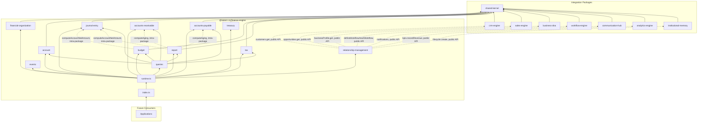
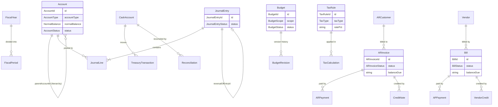

# Finance Engine — Package Architecture

> **Lateen OS Architecture v1.0 (Locked)**

## Purpose

`@lateen-os/finance-engine` is the canonical accounting layer for Lateen OS — Financial Organization setup, the Chart of Accounts, the General Ledger, Accounts Receivable, Accounts Payable, Treasury, the Budget Engine, the Tax Engine, and Financial Reports. Every capability is a **real, deterministic, in-memory implementation** — there is no contracts-only scaffold in this package; it was built directly as a real runtime (see `runtime.ts`'s `createFinanceRuntime()`).

---

## Design principles

1. **DI only, no hidden state** — every `create*` factory takes its dependencies (repositories, event bus, `now()`, and — for `budget`, `report`, and `relationship-management` — the optional external collaborators or sibling engines) explicitly. No module-level singletons.
2. **Repositories stay internal** — `createFinanceRuntime()` constructs every repository and injects it into the relevant service; only services and the query layer are returned.
3. **Journal entries cannot exist unbalanced** — `createJournalEntry()` validates `sum(debit) === sum(credit)` *before* the entry is ever persisted; there is no code path that stores an unbalanced entry.
4. **Reversal, not deletion** — `reverseJournalEntry()` creates a brand-new, already-`posted` entry with every line's debit/credit swapped, linked to the original via `reversalOfEntryId`/`reversedByEntryId`. The General Ledger is append-only.
5. **Reports and Budget variance compose, they don't duplicate** — `report`'s seven `generate*` methods and `budget`'s `computeActualVsBudget()` all read directly from the General Ledger's own posted journal entries via the shared, pure `computeAccountNetAmount()` helper (`journal-entry/engine.impl.ts`) — the arithmetic is defined exactly once.
6. **A narrow, purposeful integration surface** — of the 7 required sibling packages, each is wired to exactly one meaningful Relationship Layer capability (see below) — always through the sibling's public runtime API, never a repository, never a modification to that package.
7. **Deterministic everywhere** — guarded lifecycle state machines, fixed decimal-string arithmetic (`shared/decimal.ts`), fixed calendar-date arithmetic (`shared/date.ts`), a pluggable but still fully offline `ExchangeRateProvider`. **No LLM anywhere in this package.**

---

## Module map

| Module | Responsibility | Key exports |
| ------ | -------------- | ------------ |
| `shared/` | IDs (reusing Business DNA's/Sales Engine's canonical ids), decimal/date arithmetic, primitives, entity/domain-event/repository bases, `id.ts` helpers | — |
| `financial-organization/` | Fiscal years/periods, accounting settings, numbering sequences, `ExchangeRateProvider` abstraction | `FinancialOrganizationEngine`, `ExchangeRateProvider` |
| `account/` | Chart of Accounts — 5 account types, full lifecycle, hierarchy traversal | `ChartOfAccountsEngine`, `AccountRepository` |
| `journal-entry/` | General Ledger — balanced journal entries, posting, reversing, recurring templates | `GeneralLedgerEngine`, `JournalEntryRepository`, `computeAccountNetAmount` |
| `accounts-receivable/` | AR customers, invoices, credit notes, payments, aging, balances | `AccountsReceivableEngine`, `ARInvoiceRepository` |
| `accounts-payable/` | Vendors, bills, vendor credits, payments, aging, balances | `AccountsPayableEngine`, `BillRepository` |
| `treasury/` | Cash/bank accounts, deposits, withdrawals, transfers, reconciliation | `TreasuryEngine`, `CashAccountRepository` |
| `budget/` | Budgets, revisions, actual-vs-budget (composed with the General Ledger and Chart of Accounts) | `BudgetEngine`, `BudgetRepository` |
| `tax/` | Configurable tax rules, deterministic calculation | `TaxEngine`, `TaxRuleRepository` |
| `report/` | Deterministic financial reports, composed internally | `FinanceReportEngine`, `FinanceReportRepository` |
| `relationship-management/` | CRM Engine / Sales Engine / Business DNA / Workflow Engine / Communication Hub / Analytics Engine / Institutional Memory integration | `RelationshipManagement` |
| `queries/` | Read-side query port | `FinanceQueries` |
| `events/` | Typed event bus | `FinanceEventBus`, `FinanceEventMap` |

Each aggregate module follows: `types.ts`, `repository.ts` (port), `repository.impl.ts` (real in-memory implementation), a `*.impl.ts` service/engine file, and `index.ts`.

---

## Dependency rules

```
┌──────────────────────────────────────────────┐
│      Applications, future consumers          │
└────────────────────┬─────────────────────────┘
                     │
                     ▼
┌────────────────────────────────────────────────────┐
│              @lateen-os/finance-engine              │
└──┬────────┬─────────┬──────────┬─────────┬─────────┘
   │        │         │          │         │
   ▼        ▼         ▼          ▼         ▼
┌───────┐┌───────┐┌──────────┐┌────────┐┌───────────┐
│crm-   ││sales- ││workflow- ││communi-││analytics- │
│engine ││engine ││engine    ││cation- ││engine     │
│(relat-││(relat-││(relat-   ││hub     ││(relat-    │
│ionship││ionship││ionship-  ││(relat- ││ionship-   │
│-mgmt) ││-mgmt) ││mgmt)     ││ionship-││mgmt)      │
└───────┘└───────┘└──────────┘│mgmt)   │└───────────┘
                               └────────┘
        │              institutional-memory (relationship-mgmt)
        ▼                          │
              @lateen-os/business-dna (identifiers + relationship-mgmt)
                            │
                            ▼
                 @lateen-os/shared-kernel
```

### Allowed dependencies

- `shared-kernel` — `Entity`, `Identifier`, `Timestamp`, `EventBus`, `InMemoryRepository`, `AuditInfo`, `Money`, `CurrencyCode`, `Percentage`
- `business-dna` — `OrganizationId`, `CustomerId`, `SupplierId`, `EmployeeId`, `DepartmentId`, `ProjectId` (type-only reuse); `createBusinessDnaRuntime`'s public `businessProfile` service (optional, injected via Relationship Layer)
- `sales-engine` — `SalesOpportunityId` (type-only reuse); `createSalesRuntime`'s public `opportunities.get()` (optional, injected via Relationship Layer)
- `crm-engine` — `createCrmRuntime`'s public `customers.get()` (optional, injected via Relationship Layer)
- `workflow-engine` — `createWorkflowRuntime`'s public `defineWorkflow()` / `startWorkflow()` (optional, injected via Relationship Layer)
- `communication-hub` — `createCommunicationRuntime`'s public `notifications` service (optional, injected via Relationship Layer)
- `analytics-engine` — `createAnalyticsRuntime`'s public `kpis.recordRevenue()` (optional, injected via Relationship Layer)
- `institutional-memory` — `createInstitutionalMemoryRuntime`'s public `lifecycle.create()` (optional, injected via Relationship Layer)

### Forbidden

- Persistence, ORM, or any real database/storage backend
- AI/ML frameworks or LLM SDKs of any kind
- Importing a repository from any integration package (their public runtime APIs only)
- Modifying any integration package to accommodate the Finance Engine
- Upstream packages importing `finance-engine` (no inversion)
- Floating-point-only monetary arithmetic — all amounts are decimal strings, all arithmetic goes through `shared/decimal.ts`

---

## Dependency diagram



---

## Aggregate relationship diagram



---

## Public API

```typescript
import {
  createFinanceRuntime,
  financialOrganization,
  account,
  journalEntry,
  accountsReceivable,
  accountsPayable,
  treasury,
  budget,
  tax,
  report,
  relationshipManagement,
  queries,
  events,
  type FinanceRuntime,
  type Account,
  type JournalEntry,
  type ARInvoice,
  type Bill,
  type Budget,
  type FinanceReport,
} from '@lateen-os/finance-engine';
```

Namespace exports for each module; root re-exports for aggregate interfaces, service ports, pure calculation functions, and the composition root. Repositories are exported as **types only** (for advanced/testing use) — never as constructed instances outside `createFinanceRuntime()`.

---

## Version alignment

| Artifact | Count |
| -------- | ----- |
| Lateen OS Architecture | v1.0 Locked |
| Account types | 5 (asset, liability, equity, revenue, expense) |
| Account lifecycle states | 4 (draft, active, inactive, archived) + restore |
| AR invoice / Bill lifecycle states | 5 (draft, issued/received, partially_paid, paid, cancelled) |
| Tax types | 5 (VAT, GST, SALES_TAX, ZERO_RATED, EXEMPT) |
| Budget scopes | 3 (annual, department, project) |
| Financial report types | 7 (Balance Sheet, Income Statement, Trial Balance, Cash Flow, General Ledger Report, AR Aging, AP Aging) |
| Query methods | 9 (`FinanceQueries`) |
| Runtime events | 10 (`FinanceEventMap`) |
| External integrations | 7 (CRM Engine, Sales Engine, Business DNA, Workflow Engine, Communication Hub, Analytics Engine, Institutional Memory) — all via public API |
