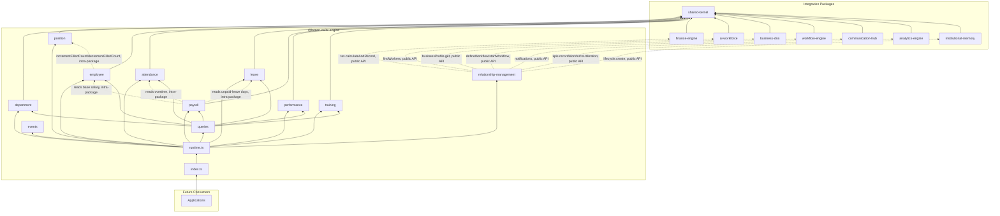
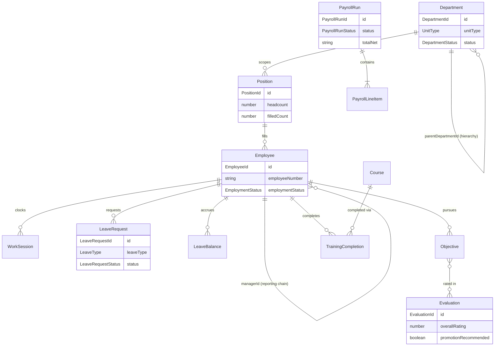

# HR Engine — Package Architecture

> **Lateen OS Architecture v1.0 (Locked)**

## Purpose

`@lateen-os/hr-engine` is the canonical human-resources layer for Lateen OS — Organization Structure, Position Management, Employee Management, the Attendance Engine, Leave Management, Payroll Preparation, Performance Management, and the Training Engine. Every capability is a **real, deterministic, in-memory implementation** — there is no contracts-only scaffold in this package; it was built directly as a real runtime (see `runtime.ts`'s `createHrRuntime()`).

---

## Design principles

1. **DI only, no hidden state** — every `create*` factory takes its dependencies (repositories, event bus, `now()`, and — for `employee` and `payroll` — sibling engines) explicitly. No module-level singletons.
2. **Repositories stay internal** — `createHrRuntime()` constructs every repository and injects it into the relevant service; only services and the query layer are returned.
3. **Position vacancy is owned in exactly one place** — Employee Management never mutates a `Position`'s `filledCount` directly; it always calls the injected `PositionManagementEngine`'s `incrementFilledCount()`/`decrementFilledCount()`, so vacancy tracking has one implementation regardless of whether the trigger was a hire, transfer, promotion, termination, or rehire.
4. **Archive/restore and terminate/rehire are deliberate asymmetries** — a `Department`'s `archived` status and an `Employee`'s `terminated` status have no outgoing edges in their ordinary transition tables; `restore()` and `rehire()` are distinct operations, the same pattern proven across Finance Engine (Chart of Accounts), AI Governance Engine (Governance Policy), and AI Compliance Engine (Framework Registry).
5. **Payroll prepares, it never posts** — `payroll`'s `preparePayroll()` reads Employee (base salary), Attendance (overtime), and Leave (unpaid-leave days) — all intra-package composition — and produces a `PayrollRun` that is pure data. The *only* place this package touches accounting is `relationship-management`'s `recordPayrollTaxWithholding()`, which calls Finance Engine's own public tax API; the HR Engine implements no ledger logic of its own.
6. **A narrow, purposeful integration surface** — of the 7 required sibling packages, each is wired to exactly one meaningful Relationship Layer capability (see below) — always through the sibling's public runtime API, never a repository, never a modification to that package.
7. **Deterministic everywhere** — guarded lifecycle state machines, fixed decimal-string arithmetic (`shared/decimal.ts`), fixed calendar/time arithmetic (`shared/date.ts`), a fixed weighted-average formula for performance ratings, a fixed threshold for promotion recommendations. **No LLM anywhere in this package.**

---

## Module map

| Module | Responsibility | Key exports |
| ------ | -------------- | ------------ |
| `shared/` | IDs, decimal/date arithmetic, primitives, entity/domain-event/repository bases, `id.ts` helpers | — |
| `department/` | Organization Structure — departments/business units/divisions, hierarchy, manager relationships, lifecycle | `OrganizationStructureEngine`, `DepartmentRepository` |
| `position/` | Position Management — job grades, salary grades, deterministic vacancy tracking | `PositionManagementEngine`, `PositionRepository` |
| `employee/` | Employee Management — guarded hire/transfer/promote/terminate/rehire lifecycle | `EmployeeManagementEngine`, `EmployeeRepository` |
| `attendance/` | Attendance Engine — clock in/out, overtime, lateness, absences, holidays | `AttendanceEngine`, `WorkSessionRepository` |
| `leave/` | Leave Management — 5 leave types, guarded lifecycle, balance tracking | `LeaveManagementEngine`, `LeaveRequestRepository` |
| `payroll/` | Payroll Preparation, composed with Employee/Attendance/Leave | `PayrollPreparationEngine`, `PayrollRunRepository` |
| `performance/` | Performance Management — review periods, objectives, evaluations | `PerformanceManagementEngine`, `EvaluationRepository` |
| `training/` | Training Engine — courses, certifications, skills, completions | `TrainingEngine`, `TrainingCompletionRepository` |
| `relationship-management/` | Finance Engine / AI Workforce / Business DNA / Workflow Engine / Communication Hub / Analytics Engine / Institutional Memory integration | `RelationshipManagement` |
| `queries/` | Read-side query port | `HrQueries` |
| `events/` | Typed event bus | `HrEventBus`, `HrEventMap` |

Each aggregate module follows: `types.ts`, `repository.ts` (port), `repository.impl.ts` (real in-memory implementation), a `*.impl.ts` service/engine file, and `index.ts`.

---

## Dependency rules

```
┌──────────────────────────────────────────────┐
│      Applications, future consumers          │
└────────────────────┬─────────────────────────┘
                     │
                     ▼
┌────────────────────────────────────────────────────┐
│                @lateen-os/hr-engine                 │
└──┬────────┬─────────┬──────────┬─────────┬─────────┘
   │        │         │          │         │
   ▼        ▼         ▼          ▼         ▼
┌───────┐┌───────┐┌──────────┐┌────────┐┌───────────┐
│finance││ai-    ││workflow- ││communi-││analytics- │
│-engine││workfor││engine    ││cation- ││engine     │
│(relat-││ce     ││(relat-   ││hub     ││(relat-    │
│ionship││(relat-││ionship-  ││(relat- ││ionship-   │
│-mgmt) ││ionship││mgmt)     ││ionship-││mgmt)      │
└───────┘│-mgmt) │└──────────┘│mgmt)   │└───────────┘
         └───────┘             └────────┘
        │              institutional-memory (relationship-mgmt)
        ▼                          │
              @lateen-os/business-dna (OrganizationId + relationship-mgmt)
                            │
                            ▼
                 @lateen-os/shared-kernel
```

### Allowed dependencies

- `shared-kernel` — `Entity`, `Identifier`, `Timestamp`, `EventBus`, `InMemoryRepository`, `AuditInfo`, `Money`, `CurrencyCode`
- `business-dna` — `OrganizationId` (type-only reuse); `createBusinessDnaRuntime`'s public `businessProfile` service (optional, injected via Relationship Layer). `Employee`/`Department` are **not** reused — they are contracts-only in Business DNA, with no runtime service to integrate against
- `finance-engine` — `createFinanceRuntime`'s public `tax.calculateAndRecord()` (optional, injected via Relationship Layer, Payroll withholding only)
- `ai-workforce` — `createWorkforceRuntime().queries`'s public `findWorkers()` (optional, injected via Relationship Layer)
- `workflow-engine` — `createWorkflowRuntime`'s public `defineWorkflow()` / `startWorkflow()` (optional, injected via Relationship Layer)
- `communication-hub` — `createCommunicationRuntime`'s public `notifications` service (optional, injected via Relationship Layer)
- `analytics-engine` — `createAnalyticsRuntime`'s public `kpis.recordWorkforceUtilization()` (optional, injected via Relationship Layer)
- `institutional-memory` — `createInstitutionalMemoryRuntime`'s public `lifecycle.create()` (optional, injected via Relationship Layer)

### Forbidden

- Persistence, ORM, or any real database/storage backend
- AI/ML frameworks or LLM SDKs of any kind
- Importing a repository from any integration package (their public runtime APIs only)
- Modifying any integration package to accommodate the HR Engine
- Upstream packages importing `hr-engine` (no inversion)
- Posting to a General Ledger, creating bills, or otherwise executing accounting from within this package — Payroll Preparation only ever produces data; any real posting happens in Finance Engine, invoked (not reimplemented) via the Relationship Layer

---

## Dependency diagram



---

## Aggregate relationship diagram



---

## Public API

```typescript
import {
  createHrRuntime,
  department,
  position,
  employee,
  attendance,
  leave,
  payroll,
  performance,
  training,
  relationshipManagement,
  queries,
  events,
  type HrRuntime,
  type Department,
  type Employee,
  type WorkSession,
  type LeaveRequest,
  type PayrollRun,
  type Evaluation,
} from '@lateen-os/hr-engine';
```

Namespace exports for each module; root re-exports for aggregate interfaces, service ports, pure calculation functions, and the composition root. Repositories are exported as **types only** (for advanced/testing use) — never as constructed instances outside `createHrRuntime()`.

---

## Version alignment

| Artifact | Count |
| -------- | ----- |
| Lateen OS Architecture | v1.0 Locked |
| Organization unit types | 3 (department, business_unit, division) |
| Employment types | 4 (full_time, part_time, contractor, intern) |
| Employment statuses | 4 (active, on_leave, suspended, terminated) |
| Leave types | 5 (annual, sick, unpaid, maternity_paternity, emergency) |
| Leave request lifecycle states | 5 (requested, approved, rejected, cancelled, completed) |
| Skill proficiency levels | 4 (beginner, intermediate, advanced, expert) |
| Query methods | 8 (`HrQueries`) |
| Runtime events | 10 (`HrEventMap`) |
| External integrations | 7 (Finance Engine, AI Workforce, Business DNA, Workflow Engine, Communication Hub, Analytics Engine, Institutional Memory) — all via public API |
