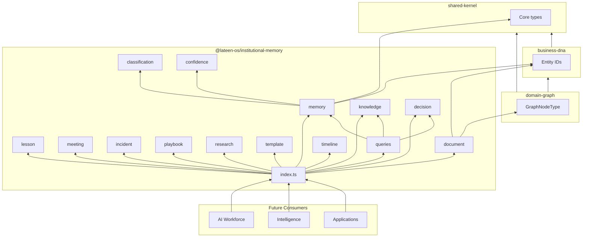
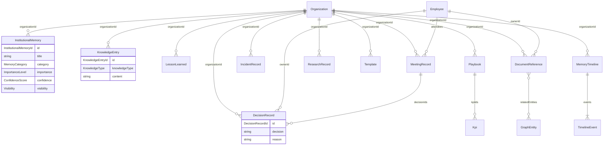

# Institutional Memory — Package Architecture

> **Lateen OS Architecture v1.0 (Locked)**

## Purpose

`@lateen-os/institutional-memory` is the **canonical Institutional Memory model** for Lateen OS — long-term organizational knowledge consumed by Proactive AI (Architecture v1.0 § Proactive AI monitoring inputs).

The package defines domain models and contracts only. No persistence, vector database, embeddings, or AI logic.

---

## Design principles

1. **Curated knowledge, not raw streams** — Memory is intentional artifacts, not chat or logs.
2. **Evidence-backed** — Confidence scores and evidence sources support trustworthiness.
3. **Classified and scoped** — Category, importance, visibility, and retention policies govern access and lifecycle.
4. **Entity-linked** — Memory connects to Business DNA via domain graph entity references.
5. **Ports only** — Repositories and queries are interfaces; implementations live in infrastructure.

---

## Module map

| Module | Responsibility |
| ------ | -------------- |
| `shared/` | IDs, primitives, entity base, events, repository ports |
| `classification/` | MemoryCategory, ImportanceLevel, Visibility, RetentionPolicy |
| `confidence/` | ConfidenceScore, Evidence, EvidenceSource |
| `memory/` | InstitutionalMemory aggregate |
| `knowledge/` | KnowledgeEntry + KnowledgeType taxonomy |
| `decision/` | DecisionRecord |
| `lesson/` | LessonLearned |
| `meeting/` | MeetingRecord + ActionItem |
| `incident/` | IncidentRecord |
| `playbook/` | Playbook + PlaybookStep |
| `research/` | ResearchRecord |
| `template/` | Template + TemplateVariable |
| `document/` | DocumentReference + RelatedEntityRef |
| `timeline/` | TimelineEvent, MemoryTimeline |
| `queries/` | MemoryQueries port |

Each aggregate module: `types`, `value-objects`, `events`, `repository`, `index`.

---

## Dependency rules

```
┌──────────────────────────────────────────────┐
│  Intelligence, AI Workforce, Applications      │
└────────────────────┬─────────────────────────┘
                     │
                     ▼
┌──────────────────────────────────────────────┐
│       @lateen-os/institutional-memory        │
└──────┬──────────────┬──────────────┬─────────┘
       │              │              │
       ▼              ▼              ▼
┌────────────┐ ┌─────────────┐ ┌──────────────┐
│ domain-    │ │ business-   │ │ shared-      │
│ graph      │ │ dna         │ │ kernel       │
└────────────┘ └─────────────┘ └──────────────┘
```

### Allowed dependencies

- `shared-kernel` — Entity, Timestamp, TimeRange, Identifier
- `business-dna` — OrganizationId, EmployeeId, KpiId, …
- `domain-graph` — GraphNodeType for entity linking

### Forbidden

- Persistence, ORM, vector DB, embedding libraries
- AI/ML frameworks
- Upstream packages importing institutional-memory
- Business logic in this package

---

## Dependency diagram



---

## Relationship diagram



---

## Proactive AI integration

Per Architecture v1.0, Proactive AI agents monitor Institutional Memory alongside Business DNA, Intelligence, and operational metrics. This package supplies the **type contracts** those agents read — implementations project memory artifacts from events and user-curated input in higher layers.

---

## Public API

```typescript
import {
  memory,
  lesson,
  classification,
  type InstitutionalMemory,
  type MemoryQueries,
} from '@lateen-os/institutional-memory';
```

Namespace exports for each module; root re-exports for aggregates, classification, confidence, query port, and repository ports.

---

## Version alignment

| Artifact | Count |
| -------- | ----- |
| Aggregates | 11 |
| Knowledge types | 10 |
| Query methods | 11 |
| Domain event sets | 11 |
