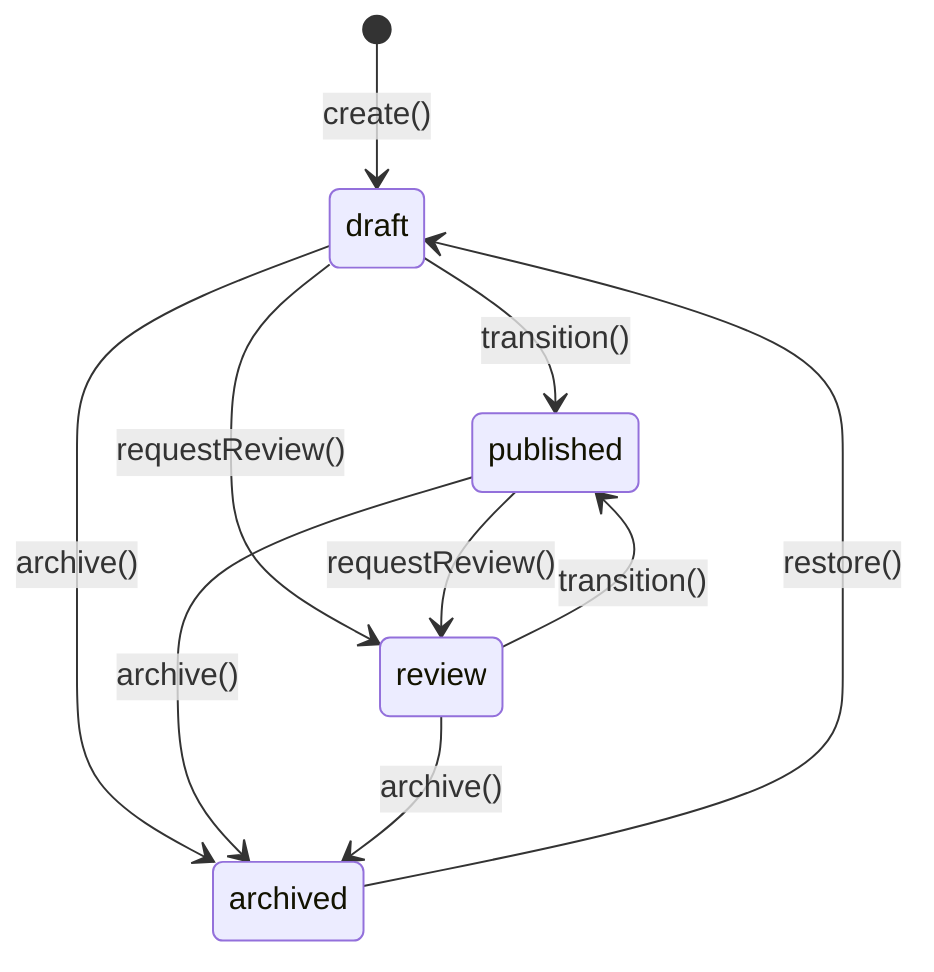

# Institutional Memory Model

> Canonical memory model for Lateen OS v1.0 — see [README.md](./README.md) for the runtime and [ARCHITECTURE.md](./ARCHITECTURE.md) for the module map.
>
> The `KnowledgeEntry` aggregate below is the one real, deterministic implementation in this package (`knowledge/*.impl.ts`, composed by `createInstitutionalMemoryRuntime()`). Every other aggregate (`InstitutionalMemory`, `DecisionRecord`, `LessonLearned`, `MeetingRecord`, `IncidentRecord`, `Playbook`, `ResearchRecord`, `Template`, `DocumentReference`, `MemoryTimeline`) remains contracts only.

## What Institutional Memory is

Institutional Memory is the organization's **curated long-term knowledge** — decisions, lessons, research, playbooks, and documented experience that persists beyond individual employees or chat sessions.

| Is | Is not |
| -- | ------ |
| Decisions with rationale | Chat history |
| Lessons learned | Application logs |
| Research findings | Raw telemetry |
| Playbooks and procedures | Vector embeddings (this package) |
| Meeting outcomes | AI inference logic |

## Aggregate overview

### InstitutionalMemory (root)

The umbrella artifact for classified, scored, and visibility-scoped memory.

| Field | Type | Description |
| ----- | ---- | ----------- |
| `id` | `InstitutionalMemoryId` | Stable identifier |
| `organizationId` | `OrganizationId` | Tenant |
| `title` | `string` | Short title |
| `summary` | `string` | Discovery summary |
| `source` | `MemorySourceLabel` | Provenance (not chat) |
| `category` | `MemoryCategory` | Classification |
| `importance` | `ImportanceLevel` | Retrieval priority |
| `confidence` | `ConfidenceScore` | Trust score (0–100) |
| `visibility` | `Visibility` | Access scope |
| `tags` | `MemoryTag[]` | Discovery tags |
| `createdAt` / `updatedAt` | `Timestamp` | Audit |

### KnowledgeEntry (real)

Typed knowledge with 14 knowledge types:

`best_practice`, `lesson_learned`, `policy`, `procedure`, `sop`, `decision`, `observation`, `research`, `insight`, `finding`, `template`, `playbook`, `faq`, `documentation`

Specialized aggregates (DecisionRecord, LessonLearned, etc.) provide **structured depth** as contracts only; `KnowledgeEntry` is the one aggregate with a **real, deterministic runtime** — lifecycle, versioning, search, relationships, validation, and retention — covering policies, SOPs, playbooks, decisions, lessons learned, FAQs, documentation, and reusable templates through this single aggregate plus its `knowledgeType` taxonomy.

In addition to the fields listed in the schema, the real `KnowledgeEntry` carries: `currentVersion` (revision counter), `ownerId` (required for `private`/`restricted` visibility), `retentionPolicy`, `expiresAt`, `reviewDueAt`, `parentKnowledgeEntryId`, `relatedKnowledgeEntryIds`, and `referenceIds`.

#### Real implementation: `KnowledgeLifecycle`

`knowledge/lifecycle.impl.ts`'s `createKnowledgeLifecycle()` implements a real, guarded state machine:

`canTransitionKnowledge(from, to)` is exported standalone for inspection. `update()` and `rollback()` reject an archived entry with `InvalidKnowledgeTransitionError` — call `restore()` first.

#### Real implementation: Memory Versioning

Every content-changing `update()` — and every `rollback()` — appends an **immutable** `KnowledgeEntryVersion` snapshot (own repository, never mutated) carrying `revisionNumber`, `title`, `content`, `authorId`, `changeSummary`, and `createdAt`. `KnowledgeEntry.currentVersion` tracks the latest revision number. `getVersionHistory()` returns the full, ordered change history; `rollback(organizationId, id, toRevisionNumber, authorId)` restores a prior revision's content as a **new** revision (the log is append-only — nothing is ever deleted).

#### Real implementation: Memory Search

`knowledge/search.impl.ts`'s `createKnowledgeSearchEngine()` performs deterministic keyword search: title matches score ×3, content matches score ×1, exact tag matches score ×2, per keyword token (case-insensitive substring counting — no embeddings, no vector database). Results are filtered first by tag/category/source/type/status, then ranked by score descending, tie-broken by `updatedAt` descending then `id` ascending.

#### Real implementation: Knowledge Relationships

`knowledge/relationships.impl.ts`'s `createKnowledgeRelationshipService()` manages three edge kinds, each cycle-guarded (`CircularRelationshipError`):

| Kind | Field | Guard |
| ---- | ----- | ----- |
| Related ("see also") | `relatedKnowledgeEntryIds` | Symmetric; self-links rejected |
| Parent/child | `parentKnowledgeEntryId` | Rejects a parent that is already a descendant (would close a loop) |
| Reference (dependency) | `referenceIds` | DFS cycle check before adding a directed edge |

`getDependencyGraph(organizationId)` returns every entry as a node and every `referenceIds` edge, for inspection or topological analysis by a consumer.

#### Real implementation: Knowledge Validation

`knowledge/validation.impl.ts`'s `createKnowledgeValidationEngine()` provides:

- `detectDuplicates()` — exact normalized-title match, or Jaccard token-overlap similarity ≥ 0.8 against `content`.
- `detectStale()` — `published` entries whose `updatedAt` is older than a configurable threshold (default 180 days).
- `validateOwnership()` — pure guard: `private`/`restricted` visibility requires an `ownerId`.
- `checkExpiration()` — entries whose `expiresAt` has passed and are not yet archived.

#### Real implementation: Retention Engine

`knowledge/retention.impl.ts`'s `createRetentionEngine()` separates **inspection** from **action**:

- `recommendCleanup()` — pure, read-only dry run returning `{ toArchive, toReview, toExpire }`.
- `applyRetentionRules()` — performs the real guarded transitions: expired entries publish `knowledge.expired` then are archived; entries past `retentionPolicy.archiveAfterDays` are archived; entries past `reviewDueAt` move to `review` via `requestReview()` (publishing `knowledge.review.required`).
- `findExpiring(withinDays)` — entries expiring within a window, for proactive surfacing.

### DecisionRecord

| Field | Description |
| ----- | ----------- |
| `decision` | What was decided |
| `reason` | Why |
| `alternatives` | Options considered |
| `outcome` | Result after implementation |
| `ownerId` | Responsible employee |
| `reviewDate` | Scheduled review |

### LessonLearned

| Field | Description |
| ----- | ----------- |
| `situation` | Context |
| `problem` | What went wrong or was challenging |
| `rootCause` | Underlying cause |
| `resolution` | What was done |
| `recommendation` | Future guidance |

### MeetingRecord

| Field | Description |
| ----- | ----------- |
| `attendees` | Employee IDs |
| `topics` | Discussion topics |
| `notes` | Meeting notes |
| `actionItems` | Follow-up tasks |
| `decisionIds` | Linked decisions |

### IncidentRecord

| Field | Description |
| ----- | ----------- |
| `severity` | critical → informational |
| `impact` | Business/operational impact |
| `cause` | Root cause |
| `resolution` | How it was resolved |
| `prevention` | Preventive measures |

### Playbook

| Field | Description |
| ----- | ----------- |
| `purpose` | Why this playbook exists |
| `steps` | Ordered procedure steps |
| `expectedOutcome` | Success criteria |
| `kpiIds` | Linked Business DNA KPIs |

### ResearchRecord

| Field | Description |
| ----- | ----------- |
| `topic` | Research subject |
| `source` | Provenance |
| `summary` | Findings summary |
| `confidence` | Confidence score |
| `recommendations` | Actionable recommendations |

### Template

| Field | Description |
| ----- | ----------- |
| `category` | Memory category |
| `content` | Template body |
| `variables` | Placeholder definitions |

### DocumentReference

| Field | Description |
| ----- | ----------- |
| `documentType` | policy, report, contract, … |
| `source` | Document provenance |
| `ownerId` | Custodian employee |
| `relatedEntities` | Links to domain graph entities |

### Timeline

| Type | Description |
| ---- | ----------- |
| `TimelineEvent` | Single chronological event |
| `MemoryTimeline` | Ordered collection of events for an entity or organization |

## Classification

| Type | Values |
| ---- | ------ |
| `MemoryCategory` | operational, strategic, technical, commercial, compliance, safety, quality, people, customer, supplier, process, general |
| `ImportanceLevel` | critical, high, medium, low, archival |
| `Visibility` | organization, department, team, private, restricted |
| `RetentionPolicy` | retain/archive/purge days, legal hold |

## Confidence

| Type | Description |
| ---- | ----------- |
| `ConfidenceScore` | Decimal string 0–100 |
| `Evidence` | Supporting evidence record |
| `EvidenceSource` | direct_observation, meeting_minutes, incident_report, research_study, … |

## Entity linking

Memory artifacts link to Business DNA entities via `DocumentReference.relatedEntities` and `MemoryQueries.findByEntity()` using `GraphNodeType` + `entityId` from `@lateen-os/domain-graph`.

## Query port

`MemoryQueries` is the original contract spanning all 11 aggregates:

- `findMemories`, `findLessons`, `findResearch`, `findDecisions`
- `findIncidents`, `findKnowledge`, `findPlaybooks`, `findTemplates`
- `findByEntity`, `findByTags`, `findByTimeRange`

### Real implementation: `KnowledgeRuntimeQueries`

`queries/knowledge-runtime-queries.impl.ts`'s `createKnowledgeRuntimeQueries()` is the real query layer exposed by `createInstitutionalMemoryRuntime()` — composed purely over the `KnowledgeEntryRepository` and engines, never returning a repository itself:

| Method | Returns |
| ------ | ------- |
| `findKnowledge()` | Entries filtered by type / status / category |
| `findPolicies()` | Entries with `knowledgeType: 'policy'` |
| `findPlaybooks()` | Entries with `knowledgeType: 'playbook'` |
| `findLessonsLearned()` | Entries with `knowledgeType: 'lesson_learned'` |
| `findTemplates()` | Entries with `knowledgeType: 'template'` |
| `findRelatedKnowledge()` | An entry's related links, parent, and children combined and deduplicated |
| `findExpiringKnowledge()` | Entries expiring within a given window (delegates to the Retention Engine) |
| `searchKnowledge()` | Deterministic keyword search results (delegates to the Memory Search engine) |

## Lifecycle pattern

Most aggregates follow: `draft` → `active`/`published` → `archived`

Domain events are emitted on each lifecycle transition. For the other 10 aggregates these are types only (no dispatch in this package); for `KnowledgeEntry`, `createInstitutionalMemoryRuntime()`'s `events` bus genuinely publishes every transition — see [README.md](./README.md#event-bus).
