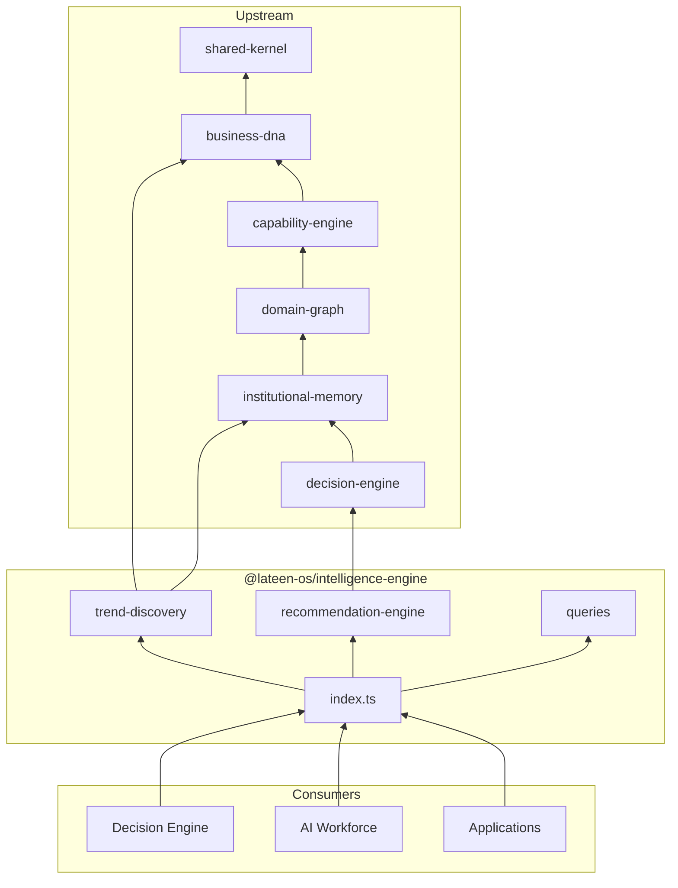
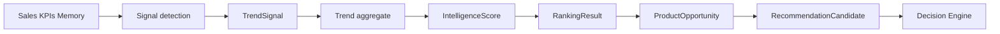
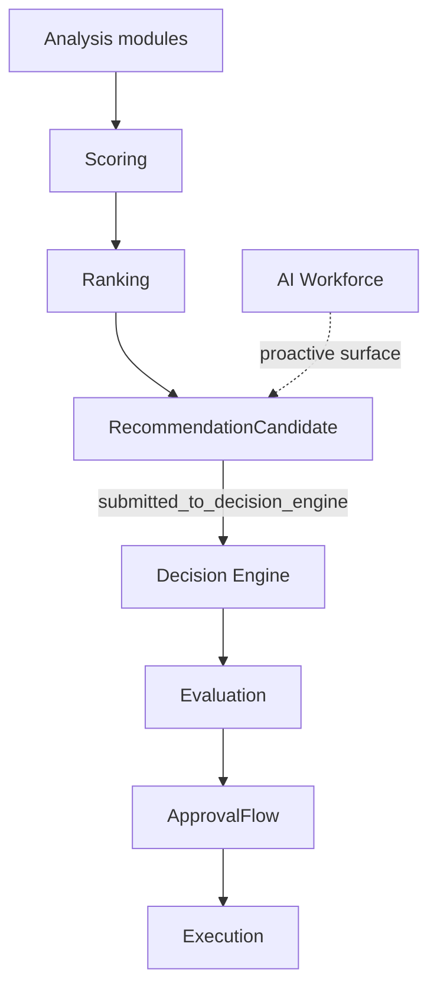

# Intelligence Engine — Package Architecture

> **Lateen OS Architecture v1.0 (Locked)** — Layer 3: Intelligence

## Purpose

`@lateen-os/intelligence-engine` is the **canonical Intelligence layer** for Lateen OS. It discovers, analyzes, forecasts, and recommends — without executing decisions or implementing AI/LLM logic.

---

## Architectural boundary

```
┌─────────────────────────────────────────────────────────┐
│  Data sources: Business DNA, Capabilities, Graph,       │
│  Institutional Memory, KPIs, external feeds             │
└──────────────────────────┬──────────────────────────────┘
                           │
                           ▼
              ┌────────────────────────┐
              │   Intelligence Engine   │
              │  (analyze & recommend)  │
              └────────────┬───────────┘
                           │
            ┌──────────────┴──────────────┐
            ▼                             ▼
   Decision Engine                 AI Workforce
   (decides)                        (surfaces insights)
```

---

## Module map

| Module | Primary aggregate |
| ------ | ----------------- |
| `trend-discovery` | Trend |
| `market-research` | Market |
| `competitor-intelligence` | Competitor |
| `product-discovery` | ProductOpportunity |
| `machine-discovery` | MachineOpportunity |
| `pricing-intelligence` | PriceAnalysis |
| `customer-insights` | CustomerInsight |
| `knowledge-mining` | KnowledgeFinding |
| `forecasting` | Forecast |
| `recommendation-engine` | RecommendationCandidate |
| `scoring` | IntelligenceScore |
| `ranking` | RankingResult |
| `signals` | Signal |
| `opportunities` | BusinessOpportunity |
| `queries` | IntelligenceQueries |

---

## Dependency diagram



---

## Trend flow diagram



---

## Recommendation flow diagram



---

## Forbidden

- LLM / AI model integration in this package
- Decision execution (Decision Engine only)
- Persistence, ORM, UI, HTTP
- Business logic implementations

---

## Public API

```typescript
import {
  trendDiscovery,
  recommendationEngine,
  type IntelligenceQueries,
} from '@lateen-os/intelligence-engine';
```

---

## Version alignment

| Artifact | Count |
| -------- | ----- |
| Capability modules | 15 |
| Aggregates with events/repos | 14 |
| Query methods | 8 |
| Upstream dependencies | 6 |
