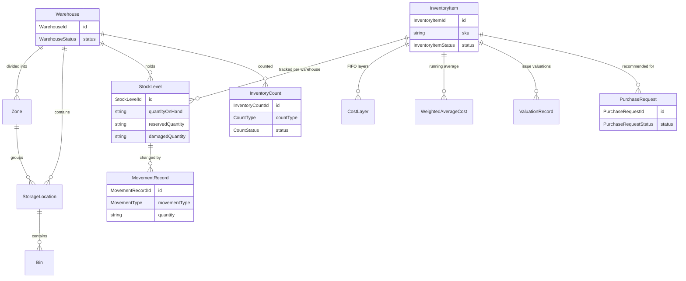

# Inventory Engine — Package Architecture

> **Lateen OS Architecture v1.0 (Locked)**

## Purpose

`@lateen-os/inventory-engine` is the canonical inventory-management layer for Lateen OS — the Inventory Catalog, Warehouse Management, Inventory Stock, Inventory Movements, Stock Valuation, Inventory Counting, and Procurement Preparation. Every capability is a **real, deterministic, in-memory implementation** — there is no contracts-only scaffold in this package; it was built directly as a real runtime (see `runtime.ts`'s `createInventoryRuntime()`).

---

## Design principles

1. **DI only, no hidden state** — every `create*` factory takes its dependencies (repositories, event bus, `now()`, and — for `movement`, `counting`, and `procurement` — sibling engines) explicitly. No module-level singletons.
2. **Repositories stay internal** — `createInventoryRuntime()` constructs every repository and injects it into the relevant service; only services and the query layer are returned.
3. **Stock arithmetic is owned in exactly one place** — Inventory Movements never mutates a `StockLevel` directly; it always calls the injected `InventoryStockEngine`'s `increaseOnHand()`/`decreaseOnHand()`/`increaseReserved()`/`decreaseReserved()`/`increaseDamaged()`/`decreaseDamaged()`. Inventory Counting's reconciliation, in turn, never mutates stock directly either — it calls Inventory Movements' own `adjust()`, so every stock change in the entire package, regardless of trigger, produces the same kind of immutable `MovementRecord`. Every one of these mutators is additionally serialized per `(itemId, warehouseId)` via `shared-kernel`'s `createKeyMutex()`, so two concurrent movements against the same stock level can never both read a stale `quantityOnHand`/`reservedQuantity` and overwrite each other's result.
4. **Movements are append-only** — there is no update or delete on `InventoryMovementEngine`'s public surface. Every receive/issue/transfer/adjustment/return/reservation/release call creates exactly one new `MovementRecord`.
5. **Archive/restore is a deliberate asymmetry** — an `InventoryItem`'s `archived` status has no outgoing edges in its ordinary transition table; `restore()` is a distinct operation that returns it to the status held immediately before archiving — the same pattern proven across Finance Engine (Chart of Accounts), HR Engine (Employee/Department), and AI Governance Engine (Governance Policy).
6. **Valuation prepares figures, it never posts them** — `valuation`'s FIFO/Weighted-Average engine computes and records cost figures only. The _only_ place this package touches accounting is `relationship-management`'s `recordInventoryValuationEntry()`, which calls Finance Engine's own public General Ledger API; the Inventory Engine implements no ledger logic of its own.
7. **Procurement recommends, it never approves** — `procurement`'s reorder suggestions, shortage detection, and purchase requests are plain deterministic data. Raising an actual multi-step approval process is the Relationship Layer's job, via Workflow Engine's public API — never implemented inside `procurement` itself.
8. **A narrow, purposeful integration surface** — of the 7 required sibling packages, each is wired to exactly one meaningful Relationship Layer capability (see below) — always through the sibling's public runtime API, never a repository, never a modification to that package.
9. **Deterministic everywhere** — guarded lifecycle state machines, fixed decimal-string arithmetic (`shared/decimal.ts`), a fixed FIFO oldest-layer-first consumption rule, a fixed weighted-average blending formula, fixed reorder/shortage threshold comparisons. **No LLM anywhere in this package.**

---

## Module map

| Module                     | Responsibility                                                                                                                           | Key exports                                                 |
| -------------------------- | ---------------------------------------------------------------------------------------------------------------------------------------- | ----------------------------------------------------------- |
| `shared/`                  | IDs, decimal/date arithmetic, primitives, entity/domain-event/repository bases, `id.ts` helpers                                          | —                                                           |
| `item/`                    | Inventory Catalog — items, categories, brands, full lifecycle                                                                            | `InventoryCatalogEngine`, `InventoryItemRepository`         |
| `warehouse/`               | Warehouse Management — warehouses, zones, storage locations, bins                                                                        | `WarehouseManagementEngine`, `WarehouseRepository`          |
| `stock/`                   | Inventory Stock — deterministic stock-level arithmetic                                                                                   | `InventoryStockEngine`, `StockLevelRepository`              |
| `movement/`                | Inventory Movements — receive/issue/transfer/adjustment/return/reservation/release, composed with Inventory Stock                        | `InventoryMovementEngine`, `MovementRecordRepository`       |
| `valuation/`               | Stock Valuation — FIFO and Weighted Average                                                                                              | `StockValuationEngine`, `CostLayerRepository`               |
| `counting/`                | Inventory Counting, composed with Inventory Stock and Inventory Movements                                                                | `InventoryCountingEngine`, `InventoryCountRepository`       |
| `procurement/`             | Procurement Preparation, composed with Inventory Stock                                                                                   | `ProcurementPreparationEngine`, `PurchaseRequestRepository` |
| `relationship-management/` | Finance Engine / Sales Engine / Business DNA / Workflow Engine / Communication Hub / Analytics Engine / Institutional Memory integration | `RelationshipManagement`                                    |
| `queries/`                 | Read-side query port                                                                                                                     | `InventoryQueries`                                          |
| `events/`                  | Typed event bus                                                                                                                          | `InventoryEventBus`, `InventoryEventMap`                    |

Each aggregate module follows: `types.ts`, `repository.ts` (port), `repository.impl.ts` (real in-memory implementation), a `*.impl.ts` service/engine file, and `index.ts`.

---

## Dependency rules

```
┌──────────────────────────────────────────────┐
│      Applications, future consumers          │
└────────────────────┬─────────────────────────┘
                     │
                     ▼
┌───────────────────────────────────────────────────────┐
│              @lateen-os/inventory-engine               │
└──┬────────┬─────────┬──────────┬─────────┬────────────┘
   │        │         │          │         │
   ▼        ▼         ▼          ▼         ▼
┌───────┐┌───────┐┌──────────┐┌────────┐┌───────────┐
│finance││sales- ││workflow- ││communi-││analytics- │
│-engine││engine ││engine    ││cation- ││engine     │
│(relat-││(relat-││(relat-   ││hub     ││(relat-    │
│ionship││ionship││ionship-  ││(relat- ││ionship-   │
│-mgmt) ││-mgmt) ││mgmt)     ││ionship-││mgmt)      │
└───────┘└───────┘└──────────┘│mgmt)   │└───────────┘
                               └────────┘
        │              institutional-memory (relationship-mgmt)
        ▼                          │
              @lateen-os/business-dna (OrganizationId/ProductId + relationship-mgmt)
                            │
                            ▼
                 @lateen-os/shared-kernel
```

### Allowed dependencies

- `shared-kernel` — `Entity`, `Identifier`, `Timestamp`, `EventBus`, `InMemoryRepository`, `AuditInfo`, `Money`, `CurrencyCode`
- `business-dna` — `OrganizationId`, `ProductId` (type-only reuse); `createBusinessDnaRuntime`'s public `products.getProduct()` (optional, injected via Relationship Layer)
- `sales-engine` — `SalesOpportunityId` (type-only reuse); `createSalesRuntime`'s public `opportunities.get()` (optional, injected via Relationship Layer)
- `finance-engine` — `createFinanceRuntime`'s public `generalLedger.createJournalEntry()` / `postJournalEntry()` (optional, injected via Relationship Layer, valuation entries only)
- `workflow-engine` — `createWorkflowRuntime`'s public `defineWorkflow()` / `startWorkflow()` (optional, injected via Relationship Layer)
- `communication-hub` — `createCommunicationRuntime`'s public `notifications` service (optional, injected via Relationship Layer)
- `analytics-engine` — `createAnalyticsRuntime`'s public `metrics.recordGauge()` (optional, injected via Relationship Layer)
- `institutional-memory` — `createInstitutionalMemoryRuntime`'s public `lifecycle.create()` (optional, injected via Relationship Layer)

### Forbidden

- Persistence, ORM, or any real database/storage backend
- AI/ML frameworks or LLM SDKs of any kind
- Importing a repository from any integration package (their public runtime APIs only)
- Modifying any integration package to accommodate the Inventory Engine
- Upstream packages importing `inventory-engine` (no inversion)
- Posting to a General Ledger, or implementing any other accounting operation, from within this package — Stock Valuation only ever produces cost figures; any real posting happens in Finance Engine, invoked (not reimplemented) via the Relationship Layer
- Implementing a purchasing approval workflow inside `procurement` — it produces recommendations and plain data records only

---

## Dependency diagram

```mermaid
flowchart BT
  subgraph consumers [Future Consumers]
    APP[Applications]
  end

  subgraph inv ["@lateen-os/inventory-engine"]
    IDX[index.ts]
    RT[runtime.ts]
    ITEM[item]
    WH[warehouse]
    STOCK[stock]
    MOVE[movement]
    VAL[valuation]
    COUNT[counting]
    PROC[procurement]
    REL[relationship-management]
    Q[queries]
    EV[events]
  end

  subgraph deps [Integration Packages]
    FIN[finance-engine]
    SALES[sales-engine]
    BD[business-dna]
    WF[workflow-engine]
    CH[communication-hub]
    ANA[analytics-engine]
    IM[institutional-memory]
    SK[shared-kernel]
  end

  APP --> IDX
  IDX --> RT
  RT --> ITEM & WH & STOCK & MOVE & VAL & COUNT & PROC & REL & Q & EV

  MOVE -.->|increase/decreaseOnHand, increase/decreaseReserved, intra-package| STOCK
  COUNT -.->|reads system quantity, intra-package| STOCK
  COUNT -.->|adjust(), intra-package| MOVE
  PROC -.->|reads thresholds, intra-package| STOCK
  Q --> ITEM & WH & STOCK & MOVE & VAL & COUNT

  REL -.->|generalLedger.createJournalEntry/postJournalEntry, public API| FIN
  REL -.->|opportunities.get, public API| SALES
  REL -.->|products.getProduct, public API| BD
  REL -.->|defineWorkflow/startWorkflow, public API| WF
  REL -.->|notifications, public API| CH
  REL -.->|metrics.recordGauge, public API| ANA
  REL -.->|lifecycle.create, public API| IM

  ITEM & WH & STOCK & MOVE & VAL & COUNT & PROC --> SK

  FIN --> SK
  SALES --> SK
  BD --> SK
  WF --> SK
  CH --> SK
  ANA --> SK
  IM --> SK
```

---

## Aggregate relationship diagram



---

## Public API

```typescript
import {
  createInventoryRuntime,
  item,
  warehouse,
  stock,
  movement,
  valuation,
  counting,
  procurement,
  relationshipManagement,
  queries,
  events,
  type InventoryRuntime,
  type InventoryItem,
  type Warehouse,
  type StockLevel,
  type MovementRecord,
  type ValuationRecord,
  type InventoryCount,
  type PurchaseRequest,
} from '@lateen-os/inventory-engine';
```

Namespace exports for each module; root re-exports for aggregate interfaces, service ports, pure calculation functions, and the composition root. Repositories are exported as **types only** (for advanced/testing use) — never as constructed instances outside `createInventoryRuntime()`.

---

## Version alignment

| Artifact                        | Count                                                                                                                                           |
| ------------------------------- | ----------------------------------------------------------------------------------------------------------------------------------------------- |
| Lateen OS Architecture          | v1.0 Locked                                                                                                                                     |
| Inventory item lifecycle states | 4 (draft, active, inactive, archived) + restore                                                                                                 |
| Warehouse hierarchy levels      | 4 (warehouse, zone, storage location, bin)                                                                                                      |
| Movement types                  | 7 (receive, issue, transfer, adjustment, return, reservation, release)                                                                          |
| Valuation methods               | 2 (FIFO, Weighted Average)                                                                                                                      |
| Count types                     | 2 (cycle, full)                                                                                                                                 |
| Count lifecycle states          | 3 (draft, in_progress, completed)                                                                                                               |
| Purchase request statuses       | 3 (suggested, acknowledged, dismissed)                                                                                                          |
| Query methods                   | 8 (`InventoryQueries`)                                                                                                                          |
| Runtime events                  | 10 (`InventoryEventMap`)                                                                                                                        |
| External integrations           | 7 (Finance Engine, Sales Engine, Business DNA, Workflow Engine, Communication Hub, Analytics Engine, Institutional Memory) — all via public API |
