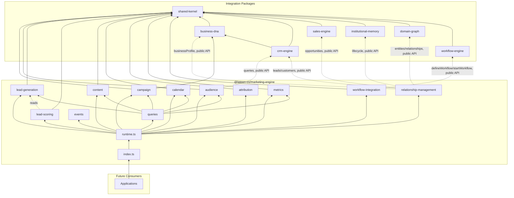
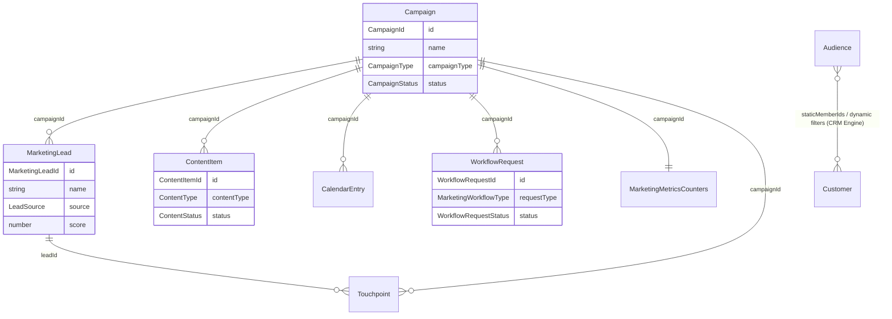

# Marketing Engine — Package Architecture

> **Lateen OS Architecture v1.0 (Locked)**

## Purpose

`@lateen-os/marketing-engine` is the canonical demand-generation layer for Lateen OS — the Campaign Lifecycle, the Audience Engine, Lead Generation + Lead Scoring, the Content Library, the Marketing Calendar, Attribution, and Marketing Metrics. Every capability is a **real, deterministic, in-memory implementation** — there is no contracts-only scaffold in this package; it was created directly as a real runtime (see `runtime.ts`'s `createMarketingRuntime()`).

---

## Design principles

1. **DI only, no hidden state** — every `create*` factory takes its dependencies (repositories, event bus, `now()`, and — for `audience`, `relationship-management`, and `workflow-integration` — the optional external collaborators) explicitly. No module-level singletons.
2. **Repositories stay internal** — `createMarketingRuntime()` constructs every repository and injects it into the relevant service; only services and the query layer are returned.
3. **A narrow, named integration surface** — CRM Engine, Sales Engine, Business DNA, Institutional Memory, Domain Graph, and Workflow Engine are consumed only where a capability explicitly names them, and only through each package's public runtime API (never their repositories, never a modification to those packages).
4. **Deterministic everywhere** — guarded lifecycle state machines, deterministic lead scoring/attribution/metrics/recurrence arithmetic, deterministic search ranking. No AI/LLM, no embeddings, no wall-clock coupling in business logic.
5. **Composition over duplication** — `queries` reads the same repositories the aggregate modules own, rather than each keeping a parallel read model.

---

## Module map

| Module | Responsibility | Key exports |
| ------ | -------------- | ------------ |
| `shared/` | IDs (reusing Business DNA's canonical ids), primitives, entity/domain-event/repository bases, `id.ts`/`errors.ts` helpers | — |
| `campaign/` | Campaign Lifecycle + deterministic Campaign Types | `CampaignLifecycle`, `CampaignRepository`, `CampaignType` |
| `audience/` | Audience Engine, composed with CRM Engine | `AudienceEngine`, `AudienceRepository`, `applyAudienceFilters()` (pure) |
| `lead-generation/` | Lead Generation | `LeadGenerationService`, `MarketingLeadRepository` |
| `lead-scoring/` | Lead Scoring | `LeadScoringEngine`, `computeLeadScore()` (pure) |
| `content/` | Content Library | `ContentLibrary`, `ContentRepository` |
| `calendar/` | Marketing Calendar | `MarketingCalendarService`, `CalendarRepository`, `generateOccurrences()` (pure) |
| `attribution/` | Attribution | `AttributionEngine`, `TouchpointRepository`, `computeAttribution()` (pure) |
| `metrics/` | Marketing Metrics | `MarketingMetricsEngine`, `MarketingMetricsRepository`, `computeDerivedMetrics()` (pure) |
| `workflow-integration/` | Workflow Integration, composed with Workflow Engine | `WorkflowIntegrationService`, `WorkflowRequestRepository` |
| `relationship-management/` | CRM Engine / Sales Engine / Business DNA / Institutional Memory / Domain Graph integration | `RelationshipManagement` |
| `queries/` | Read-side query port | `MarketingQueries` |
| `events/` | Typed event bus | `MarketingEventBus`, `MarketingEventMap` |

Each aggregate module follows: `types.ts`, `repository.ts` (port), `repository.impl.ts` (real in-memory implementation), a `*.impl.ts` lifecycle/service/engine file, and `index.ts`.

---

## Dependency rules

```
┌──────────────────────────────────────────────┐
│      Applications, future consumers          │
└────────────────────┬─────────────────────────┘
                     │
                     ▼
┌────────────────────────────────────────────────┐
│            @lateen-os/marketing-engine          │
└──┬──────────┬───────────┬──────────┬────────┬──┘
   │          │           │          │        │
   ▼          ▼           ▼          ▼        ▼
┌────────┐ ┌────────┐ ┌─────────┐ ┌──────┐ ┌───────────┐
│business│ │crm-    │ │sales-   │ │insti-│ │domain-graph│
│-dna    │ │engine  │ │engine   │ │tution│ │            │
└────────┘ └────────┘ └─────────┘ │al-   │ └───────────┘
                                   │memory│
                                   └──────┘
        (workflow-engine consumed by workflow-integration too)
                     │
                     ▼
            @lateen-os/shared-kernel
```

### Allowed dependencies

- `shared-kernel` — `Entity`, `Identifier`, `Timestamp`, `EventBus`, `InMemoryRepository`, `AuditInfo`, `CurrencyCode`
- `business-dna` — `OrganizationId`, `CustomerId`, `EmployeeId` (type-only reuse); `createBusinessDnaRuntime`'s public `businessProfile` service (optional, injected)
- `crm-engine` — `createCrmRuntime`'s public `queries` (Audience Engine), `leads` and `customers` services (Relationship Layer) (optional, injected)
- `sales-engine` — `createSalesRuntime`'s public `opportunities` service (optional, injected)
- `institutional-memory` — `createInstitutionalMemoryRuntime`'s public `lifecycle` service (optional, injected)
- `domain-graph` — `createDomainGraphRuntime`'s public `entities` / `relationships` services (optional, injected)
- `workflow-engine` — `createWorkflowRuntime`'s public `defineWorkflow` / `startWorkflow` composition-root operations (optional, injected)

### Forbidden

- Persistence, ORM, vector DB, embedding libraries
- AI/ML frameworks or LLM SDKs
- Importing a repository from any integration package (their public runtime APIs only)
- Modifying any integration package to accommodate the Marketing Engine
- Upstream packages importing `marketing-engine` (no inversion)

---

## Dependency diagram



---

## Aggregate relationship diagram



---

## Public API

```typescript
import {
  createMarketingRuntime,
  campaign,
  audience,
  leadGeneration,
  leadScoring,
  content,
  calendar,
  attribution,
  metrics,
  workflowIntegration,
  relationshipManagement,
  queries,
  events,
  type MarketingRuntime,
  type Campaign,
  type MarketingLead,
  type CampaignType,
} from '@lateen-os/marketing-engine';
```

Namespace exports for each module; root re-exports for aggregate interfaces, lifecycle/service ports, and the composition root. Repositories are exported as **types only** (for advanced testing) — never as constructed instances outside `createMarketingRuntime()`.

---

## Version alignment

| Artifact | Count |
| -------- | ----- |
| Lateen OS Architecture | v1.0 Locked |
| Campaign types | 9 (email, social, sms, whatsapp, webinar, event, paid_ads, organic, referral) |
| Campaign Lifecycle actions | 8 (create, update, schedule, launch, pause, resume, complete, archive) |
| Lead generation sources | 5 (inbound, outbound, referral, event, manual_import) |
| Lead scoring factors | 5 (engagement, source, profile completeness, activity count, recency) |
| Attribution models | 3 (first_touch, last_touch, linear) |
| Marketing workflow request types | 4 (campaign_approval, asset_review, publishing, follow_up) |
| Query methods | 8 (`MarketingQueries`) |
| Runtime events | 9 (`MarketingEventMap`) |
| External integrations | 6 (CRM Engine, Sales Engine, Business DNA, Institutional Memory, Domain Graph, Workflow Engine) — all via public API |
