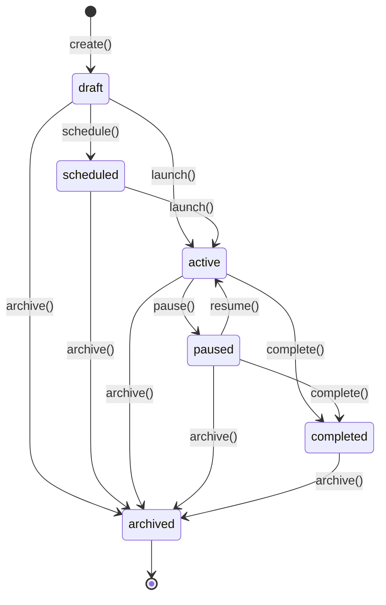

# Marketing Model

> Real, implemented model for the Marketing Engine — see [README.md](./README.md) for the runtime and [ARCHITECTURE.md](./ARCHITECTURE.md) for the module map.

---

## Campaign Lifecycle + Campaign Types

`campaign/lifecycle.impl.ts`'s `createCampaignLifecycle()` implements the required 8 lifecycle actions atop a guarded status state machine (`canTransitionCampaign()`), over the 9 required deterministic campaign types (`email`, `social`, `sms`, `whatsapp`, `webinar`, `event`, `paid_ads`, `organic`, `referral`):

- **`create()`** — status `'draft'`. Publishes `campaign.created`.
- **`update()`** — guarded to `'draft'` or `'scheduled'` (a launched campaign's identity/budget/owner is fixed).
- **`schedule(scheduledAt, endAt?)`** — `'draft'` → `'scheduled'`, stamping the launch window.
- **`launch()`** — `'draft'` or `'scheduled'` → `'active'`, stamps `launchedAt`. Publishes `campaign.launched`.
- **`pause()`** — `'active'` → `'paused'`, stamps `pausedAt`. Publishes `campaign.paused`.
- **`resume()`** — `'paused'` → `'active'`. No dedicated event — the campaign was already `'launched'`.
- **`complete()`** — `'active'` or `'paused'` → `'completed'`, stamps `completedAt`. Publishes `campaign.completed`.
- **`archive()`** — any non-archived status → `'archived'`. Terminal.

---

## Audience Engine

`audience/engine.impl.ts`'s `createAudienceEngine()` supports both required audience kinds:

- **Static audiences** — a fixed `staticMemberIds` list of CRM Engine customer ids. `resolveAudience()` returns it directly — no CRM Engine dependency needed.
- **Dynamic audiences** — a list of deterministic `AudienceFilter`s (`field`: `name` / `email` / `company` / `tag`; `operator`: `eq` / `contains`). `resolveAudience()` fetches every real CRM Engine customer via `crm.queries.findCustomers()` (the CRM Engine's public API — never a repository) and applies `applyAudienceFilters()`, a pure function requiring every filter to match (AND semantics).

Both kinds share the same guarded `create` / `update` / `archive` / `get` lifecycle. CRM Engine is optional — a dynamic audience resolves to an empty list when it is not injected, keeping the engine fully usable offline; segmentation itself (`applyAudienceFilters()`) is pure and independently testable without any collaborator.

---

## Lead Generation + Lead Scoring

`lead-generation/service.impl.ts`'s `createLeadGenerationService()` captures leads from the 5 required channels — `inbound`, `outbound`, `referral`, `event`, `manual_import` — each optionally attributable to a `campaignId`. `generateLead()` publishes `lead.generated`.

`lead-scoring/engine.impl.ts`'s `createLeadScoringEngine()` computes a deterministic 0-100 score — **no AI model** — as a fixed weighted sum of 5 factors:

| Factor | Weight | Formula |
| ------ | ------ | ------- |
| Engagement | 30% | the lead's own `engagementScore` (0-100 input) |
| Source | 20% | a fixed lookup table, `SOURCE_SCORE_WEIGHT`: `referral` 100, `inbound` 80, `event` 70, `outbound` 50, `manual_import` 30 |
| Profile completeness | 20% | the lead's own `profileCompletenessPct` (0-100 input) |
| Activity count | 15% | `min(activityCount, 10) × 10` — caps out at 10 recorded activities |
| Recency | 15% | `computeRecencyScore()`: 100 at same-day activity, decaying linearly to 0 at 90 days since `lastActivityAt` |

`scoreLead()` recomputes and persists the score, publishing `lead.scored`.

---

## Content Library

`content/library.impl.ts`'s `createContentLibrary()` manages the 4 required content kinds — `template`, `asset`, `landing_page`, `media_reference` — each optionally linked to a `campaignId`, through a guarded `create` (`'draft'`) → `publish` (`'published'`) → `archive` (`'archived'`) lifecycle. `createContent()` publishes `content.created`.

---

## Marketing Calendar

`calendar/service.impl.ts`'s `createMarketingCalendarService()` supports one-off and recurring campaign schedules and launch windows. `generateOccurrences(entry, rangeStart, rangeEnd)` is a pure, deterministic expansion: a non-recurring entry yields at most one occurrence; a recurring entry (`daily` / `weekly` / `monthly`, every `interval` units, optionally capped at `count`) yields every occurrence date landing within `[rangeStart, rangeEnd]`. `listOccurrencesInRange()` expands every active (non-cancelled) entry for an organization at once.

---

## Attribution

`attribution/engine.impl.ts` supports the 3 required deterministic attribution models via one pure function, `computeAttribution(touchpoints, model)` (touchpoints are sorted by `occurredAt` internally, regardless of input order):

- **`first_touch`** — the earliest touchpoint's campaign receives full credit (weight `1`).
- **`last_touch`** — the latest touchpoint's campaign receives full credit.
- **`linear`** — credit is split evenly across every touchpoint (`1 / n` each), summed per campaign — a campaign touched twice earns twice the per-touch weight.

`createAttributionEngine()` additionally records real touchpoints (`recordTouchpoint()`) and computes attribution for a lead's full touchpoint history (`computeAttributionForLead()`).

---

## Marketing Metrics

`metrics/engine.impl.ts`'s `createMarketingMetricsEngine()` tracks cumulative, additive counters per campaign — `impressions`, `clicks`, `opens`, `conversions`, `customersAcquired`, `cost`, `revenue` — and derives, via the pure `computeDerivedMetrics()`:

| Metric | Formula |
| ------ | ------- |
| CPL (cost per lead) | `cost / conversions`, `0.00` if no conversions |
| CAC (customer acquisition cost) | `cost / customersAcquired`, `0.00` if none acquired |
| ROI | `(revenue - cost) / cost × 100`, `0.00` if no cost recorded |

`recordMetrics()` additively applies new deltas and publishes `metrics.updated`; `getMetrics()` always returns a full snapshot, zeroed for a campaign with nothing recorded yet.

---

## Workflow Integration — composed with the Workflow Engine

`workflow-integration/service.impl.ts`'s `createWorkflowIntegrationService()` generates deterministic workflow requests for the 4 required request types — `campaign_approval`, `asset_review`, `publishing`, `follow_up` — by composing the real, injected Workflow Engine's public `defineWorkflow()` + `startWorkflow()` operations, never a Workflow Engine repository:

1. **`generateRequest()`** lazily defines (once per organization + request type, cached in-process) a canonical single-step `'human'`-task workflow, then starts a real instance carrying `{ campaignId, notes, dueAt }` as workflow variables. The resulting `WorkflowRequest` records both the `workflowDefinitionId` and `workflowInstanceId`, and publishes `workflow.requested`.
2. **`completeRequest()`** marks the request `'completed'`. No dedicated "approved" event is required for Marketing's workflow requests — the `approved` outcome is simply recorded on the request itself.
3. **`cancelRequest()`** marks the request `'cancelled'`.

The Workflow Engine collaborator is optional — with it absent, requests are still recorded, just with no workflow linkage, keeping the Marketing Engine fully usable offline.

---

## Relationship Layer — the only integration surface with CRM Engine, Sales Engine, Business DNA, Institutional Memory, and Domain Graph

Per the architecture rules, `relationship-management/service.impl.ts` is the module that talks to these five sibling packages for anything beyond `audience`'s Product—err, Customer—query composition — and only through each package's public runtime API:

| Integration | How | Required? |
| ------------ | --- | ---------- |
| CRM Engine | `syncLeadToCrm()` creates a real CRM Engine lead via `leads.create()`; `getCustomerContext()` fetches a real customer via `customers.get()` | Optional — inject `{ crm }` |
| Sales Engine | `getOpportunityContext()` fetches a real Sales Engine opportunity via `opportunities.get()` | Optional — inject `{ sales }` |
| Business DNA | `getBusinessProfileContext()` fetches the real `BusinessProfile` via `businessProfile.get()` | Optional — inject `{ businessDna }` |
| Institutional Memory | `logCampaignToMemory()` creates a real Institutional Memory `KnowledgeEntry` (`knowledgeType: 'observation'`, `category: 'commercial'`, `source: 'marketing-engine'`, tagged with `'marketing'` and the campaign type) | Optional — inject `{ institutionalMemory }` |
| Domain Graph | `syncCampaignToGraph()` registers or updates a real Domain Graph `'campaign'` entity (matching on `nodeType` + `entityId` via `entities.list()` before deciding register vs. update) | Optional — inject `{ domainGraph }` |

Every method returns `null` when its collaborator wasn't injected at `createMarketingRuntime()` time — never throws, never mocks. The Marketing Engine's own test suite proves each integration is **real** by constructing actual `createCrmRuntime()` / `createSalesRuntime()` / `createBusinessDnaRuntime()` / `createInstitutionalMemoryRuntime()` / `createDomainGraphRuntime()` instances and asserting genuine cross-package state — never a mock of any sibling package.

---

## Query Layer

`queries/marketing-queries.impl.ts`'s `createMarketingQueries()` is the real, read-only query layer exposed by `createMarketingRuntime()` — composed purely over the Marketing Engine repositories, never returning one:

| Method | Returns |
| ------ | ------- |
| `findCampaigns()` | Campaigns filtered by status / campaign type |
| `findAudiences()` | Audiences filtered by audience type / status |
| `findAssets()` | Content items restricted to `asset` / `landing_page` / `media_reference` kinds |
| `findContent()` | **Every** content item (including templates), filtered by content type / status / campaignId |
| `findLeads()` | Marketing leads filtered by source / status / campaignId / minimum score |
| `findMetrics()` | Metrics snapshots (raw counters + derived CPL/CAC/ROI), for one campaign or every campaign |
| `findCalendar()` | Calendar entries, optionally filtered by campaignId, sorted by start time |
| `searchMarketing()` | Deterministic keyword search across campaigns (by name) and content (by title), exact match scored above substring match, ranked and tie-broken by id |

`findAssets()` and `findContent()` intentionally overlap: `findContent()` is the full library view (including templates); `findAssets()` is the narrower "things attached to a campaign" view.

---

## Constraints

- No UI, API, LLM, or persistence-adapter implementation in this package — every repository is in-memory and internal to `createMarketingRuntime()`.
- Deterministic and offline: every `create*` factory accepts an injectable `now()`; scoring/attribution/metrics/recurrence arithmetic and search ranking never depend on Map/Set iteration order.
- CRM Engine, Sales Engine, Business DNA, Institutional Memory, Domain Graph, and Workflow Engine are touched **only** through `audience` (behavioral, CRM Engine), `relationship-management` (behavioral, CRM/Sales/Business DNA/Institutional Memory/Domain Graph), `workflow-integration` (behavioral, Workflow Engine), and `shared/identifiers.ts` (structural) — never their repositories, never a change to those packages.
