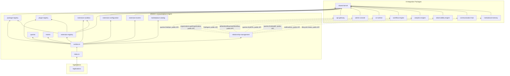
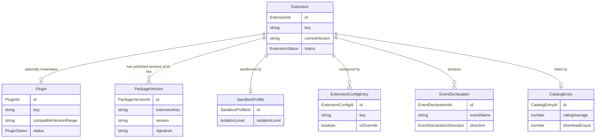

# Marketplace — Package Architecture

> **Lateen OS Architecture v1.0 (Locked)**

## Purpose

`@lateen-os/marketplace-engine` is the extension platform for Lateen OS — the Extension Registry, Plugin Registry, Package Registry, Extension Sandbox, Extension Configuration, Extension Events, and the Marketplace Catalog. Every capability is a **real, deterministic, in-memory implementation** — there is no contracts-only scaffold in this package; it was built directly as a real runtime (see `runtime.ts`'s `createMarketplaceRuntime()`).

---

## Design principles

1. **DI only, no hidden state** — every `create*` factory takes its dependencies (repositories, event bus, `now()`) explicitly. No module-level singletons.
2. **Repositories stay internal** — `createMarketplaceRuntime()` constructs every repository and injects it into the relevant service; only services, the query layer, and the event bus are returned.
3. **No code execution, anywhere** — the Extension Sandbox is deterministic metadata bookkeeping only (allowed capabilities, granted permissions, a declared isolation level); it never loads, evaluates, or executes any extension code. Extension Events is likewise metadata-only — declared subscriptions/publications are never wired onto a live event bus by this package.
4. **A real, dependency-free semver comparator** — `shared/semver.ts`'s `compareVersions()`/`satisfiesRange()` support plain `MAJOR.MINOR.PATCH` versions and single-operator ranges (`>=`, `<=`, `>`, `<`, `=`); never an external semver library, and deliberately not a full semver range grammar (no `^`, `~`, or compound ranges) — this is compatibility *checking*, not a package manager.
5. **A real content-integrity signature, not a placeholder** — `package-registry/engine.impl.ts`'s `computeSignature()` is a genuine SHA-256 digest (via Node's built-in `crypto`) over the canonical `(extensionKey, version, dependencies)` content, computed at publish time and never caller-supplied. `verifySignature()` re-derives nothing — it's a real repository-backed comparison against the stored digest.
6. **The Extension Registry composes, never duplicates, its three sibling modules** — `validateExtension()` checks package-version existence (Package Registry), plugin version-range compatibility (Plugin Registry, only when a `pluginId` is set), and sandbox-profile presence (Extension Sandbox) — each check delegates entirely to that module's own engine, accumulating human-readable reasons rather than re-implementing any of their logic.
7. **A fixed, four-state extension lifecycle** — `installed → enabled ⇄ disabled → uninstalled`, guarded by `canTransitionExtension()` (pure); `uninstalled` is terminal. `upgrade()` is deliberately independent of this state machine — it changes `currentVersion` without touching `status`, and is blocked only once `uninstalled`.
8. **A narrow, explicit integration surface across 8 sibling packages** — each is wired to exactly one meaningful Relationship Layer method (see below), always through the sibling's public runtime API, never a repository, never a modification to that package. AI Runtime has no single `createXRuntime()` composition root, so its Relationship Layer dependency is typed directly against `Pick<RuntimeQueries, 'findAgent'>` — the same documented special case used by every other package in this monorepo that integrates with AI Runtime.
9. **Deterministic everywhere** — a guarded lifecycle state machine, a real hash-based signature, a real semver comparator, a fixed running-average rating calculation, fixed field-level configuration validation. **No LLM or AI inference anywhere in this package.**

---

## Module map

| Module | Responsibility | Key exports |
| ------ | -------------- | ------------ |
| `shared/` | IDs, a real semver comparator, primitives, 12 typed errors | — |
| `package-registry/` | Versions, dependencies, real SHA-256 signatures | `PackageRegistryEngine`, `computeSignature` |
| `plugin-registry/` | Plugins, capabilities, required permissions, compatibility | `PluginRegistryEngine`, `canTransitionPlugin` |
| `extension-sandbox/` | Deterministic capability/permission/isolation metadata | `ExtensionSandboxEngine` |
| `extension-registry/` | install/uninstall/enable/disable/upgrade, `validateExtension()` | `ExtensionRegistryEngine`, `canTransitionExtension` |
| `extension-configuration/` | Defaults, overrides, validation | `ExtensionConfigurationEngine`, `validateExtensionConfig` |
| `extension-events/` | Declared subscriptions/publications, compatibility | `ExtensionEventsEngine` |
| `marketplace-catalog/` | Categories, publishers, ratings, downloads | `MarketplaceCatalogEngine`, `computeRunningAverage` |
| `relationship-management/` | 8-collaborator integration | `RelationshipManagement` |
| `queries/` | Read-side query port | `MarketplaceQueries` |
| `events/` | Typed event bus | `MarketplaceEventBus`, `MarketplaceEventMap` |

Each aggregate module follows: `types.ts`, `repository.ts` (port), `repository.impl.ts` (real in-memory implementation), a `*.impl.ts` service/engine file, and `index.ts`.

---

## Dependency rules

### Allowed dependencies

- `shared-kernel` — `Entity`, `Identifier`, `Timestamp`, `EventBus`, `InMemoryRepository`, `AuditInfo`
- `business-dna` — `OrganizationId` (type-only reuse)
- `api-gateway` — `queries.findApis()` (optional, injected via Relationship Layer)
- `admin-console` — `organizations.getOrganization()` (optional, injected via Relationship Layer)
- `ai-runtime` — `RuntimeQueries.findAgent()` (optional, injected via Relationship Layer; no composition-root wrapper exists for this package, so the raw `RuntimeQueries` slice is injected directly)
- `workflow-engine` — `defineWorkflow()` / `startWorkflow()` (optional, injected via Relationship Layer)
- `analytics-engine` — `queries.findKPIs()` (optional, injected via Relationship Layer)
- `observability-engine` — `queries.findHealth()` (optional, injected via Relationship Layer)
- `communication-hub` — `notifications` service (optional, injected via Relationship Layer)
- `institutional-memory` — `lifecycle.create()` (optional, injected via Relationship Layer)

### Forbidden

- Any code execution, sandboxed or otherwise — this package models capabilities/permissions/isolation as metadata only
- Persistence, ORM, or any real database/storage backend
- AI/ML frameworks or LLM SDKs of any kind
- Importing a repository from any integration package (their public runtime APIs only)
- Modifying any integration package to accommodate the Marketplace
- Upstream packages importing `marketplace` (no inversion)
- An external semver library or an external cryptographic-signing library — both are real, hand-rolled, dependency-free implementations in this package (the signature uses Node's built-in `crypto`, not a third-party dependency)

---

## Dependency diagram



---

## Aggregate relationship diagram



---

## Public API

```typescript
import {
  createMarketplaceRuntime,
  extensionRegistry,
  pluginRegistry,
  packageRegistry,
  extensionSandbox,
  extensionConfiguration,
  extensionEvents,
  marketplaceCatalog,
  relationshipManagement,
  queries,
  events,
  type MarketplaceRuntime,
  type Extension,
  type Plugin,
  type PackageVersion,
  type SandboxProfile,
  type CatalogEntry,
} from '@lateen-os/marketplace-engine';
```

Namespace exports for each module; root re-exports for aggregate interfaces, service ports, pure functions, and the composition root. Repositories are exported as **types only** (for advanced/testing use) — never as constructed instances outside `createMarketplaceRuntime()`.

---

## Version alignment

| Artifact | Count |
| -------- | ----- |
| Lateen OS Architecture | v1.0 Locked |
| Extension statuses | 4 (installed, enabled, disabled, uninstalled) |
| Plugin statuses | 3 (active, deprecated, archived) |
| Isolation levels | 4 (none, process, container, vm) |
| Event declaration directions | 2 (subscribes, publishes) |
| Query methods | 7 (`MarketplaceQueries`) |
| Runtime events | 10 (`MarketplaceEventMap`) |
| External integrations | 8 (API Gateway, Admin Console, AI Runtime, Workflow Engine, Analytics Engine, Observability Engine, Communication Hub, Institutional Memory) — all via public API |
