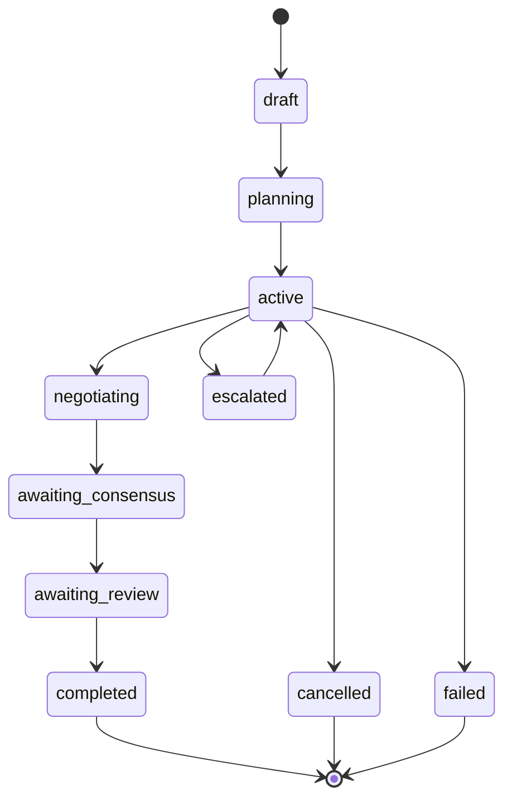
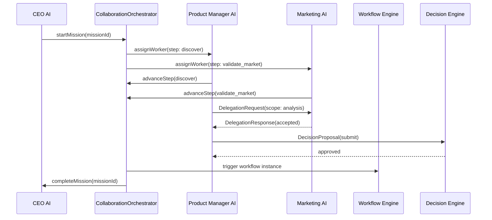
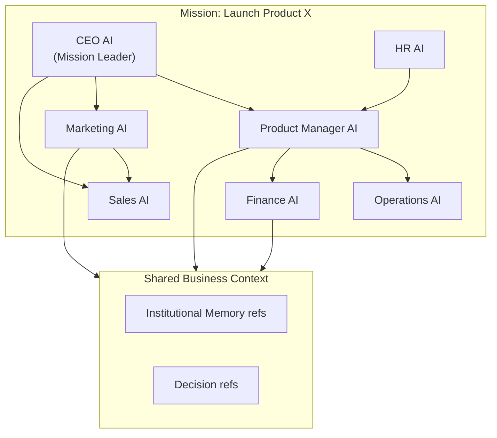
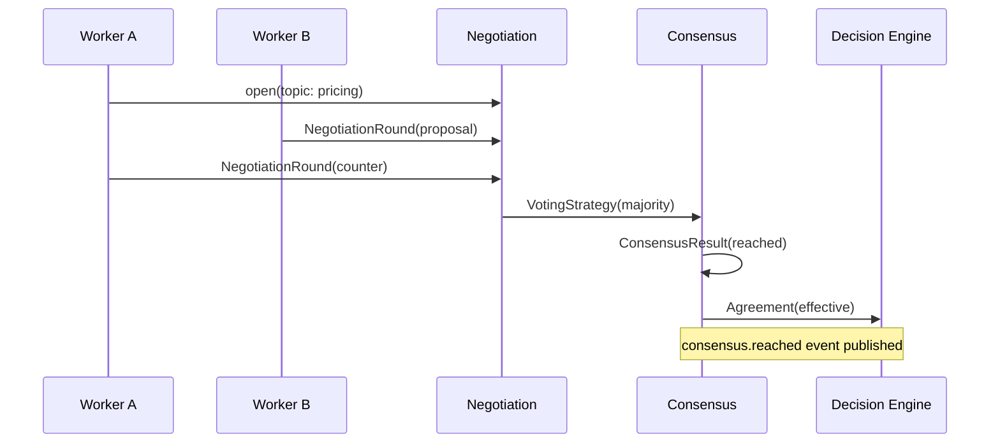

# Multi-Agent — Mission Model

> Real, implemented model for multi-agent collaboration on business objectives — see [README.md](./README.md) for the runtime and [ARCHITECTURE.md](./ARCHITECTURE.md) for the module map.

---

## Mission lifecycle

---

## Collaboration sequence

---

## Team collaboration diagram

---

## Negotiation → Consensus flow

---

## Escalation levels

| Level | Resolver |
| ----- | -------- |
| `team_lead` | Mission leader (typically CEO AI) |
| `ceo_ai` | Organization-level CEO AI worker |
| `decision_engine` | Decision Engine policy evaluation |
| `human_operator` | Human-in-the-loop override |

---

## Worker roles

| Role | Typical responsibility |
| ---- | ---------------------- |
| `ceo_ai` | Mission leadership, final escalation |
| `product_manager_ai` | Product discovery, roadmap |
| `marketing_ai` | Market validation, positioning |
| `sales_ai` | Revenue projections, channel fit |
| `operations_ai` | Manufacturing, logistics |
| `finance_ai` | ROI, margin, budget |
| `hr_ai` | Workforce capacity, skills |

---

## Domain events

The real, published `CollaborationEventMap` (see [README.md](./README.md#event-bus) for the full list):

| Event | When |
| ----- | ---- |
| `mission.started` | Mission enters active execution |
| `mission.completed` | All coordination steps resolved (success or failure) |
| `mission.escalated` | Orchestrator escalates a mission via the Escalation service |
| `agent.registered` | An agent is registered for collaboration |
| `agent.availability_changed` | An agent's availability changes |
| `session.started` / `session.ended` | A worker joins/leaves a mission |
| `message.routed` | A message is broadcast to a conversation's participants |
| `delegation.requested` / `delegation.responded` | Inter-worker delegation lifecycle |
| `consensus.reached` | A vote tally is recorded |
| `conflict.detected` / `conflict.resolved` | Competing proposals are found/resolved |
| `coordination_step.advanced` | A coordination step progresses |

---

## Query ports

The real `CollaborationQueries` port (see `queries/collaboration-queries.ts`):

| Method | Purpose |
| ------ | ------- |
| `findMission()` | Discover missions by status/code/id |
| `findTeams()` | List teams for a mission or by team id |
| `findOpenNegotiations()` | Active negotiation sessions |
| `findPendingReviews()` | Reviews awaiting action |
| `findConsensus()` | Consensus results by mission |
| `findAgents()` | Registered agents by role/availability |
| `findConflicts()` | Conflicts by mission/status |
| `findWorkingMemory()` | Shared working-memory entries by mission/key |
| `findActiveSessions()` | Active agent sessions for a mission |
| `findCoordinationPlan()` | A mission's coordination plan and steps |
