# Observability Platform — Package Architecture

> **Lateen OS Architecture v1.0 (Locked)**

## Purpose

`@lateen-os/observability-engine` is the canonical runtime-visibility layer for Lateen OS — Structured Logging, the Metrics Collector, Distributed Tracing, the Health Engine, the Alert Engine, the Performance Engine, the Audit Timeline, and the Snapshot Engine. Every capability is a **real, deterministic, in-memory implementation** — there is no contracts-only scaffold in this package; it was created directly as a real runtime (see `runtime.ts`'s `createObservabilityRuntime()`).

This package is unique among Lateen OS engines in one respect: it is a **read-only aggregator**. It never mutates any of the 7 integrated packages — every module only calls `find*` query methods and persists its own observability record locally.

---

## Design principles

1. **DI only, no hidden state** — every `create*` factory takes its dependencies (repositories, event bus, `now()`, and the optional sibling-package query ports) explicitly. No module-level singletons.
2. **Repositories stay internal** — `createObservabilityRuntime()` constructs every repository and injects it into the relevant service; only services and the query layer are returned.
3. **Narrow modules own their integration; the Relationship Layer adds one more real signal per package** — Health/Alert/Performance/Audit-Timeline/Snapshot each integrate the specific sibling packages their capability naturally needs. The Relationship Layer additionally integrates all 7 packages through one distinct, real query each, so every integration point is exercised without duplicating logic.
4. **Real signals only, no synthetic timestamps** — execution time and queue latency are derived from AI Runtime's own real `createdAt`/`updatedAt`/`completedAt` fields (the task queue genuinely updates `updatedAt` at dequeue time), never from caller-supplied estimates.
5. **Recomputed, not live views** — Health checks, alerts, performance samples, audit timeline entries, and snapshots are computed on demand and persisted; the Query Layer reads persisted records, it does not re-query sibling packages itself.
6. **Deterministic everywhere** — fixed classification thresholds (health/alert severity), no randomness. **No LLM anywhere in this package.**

---

## Module map

| Module | Responsibility | Key exports |
| ------ | -------------- | ------------ |
| `shared/` | IDs (reusing Workflow Engine's canonical `OrganizationId`), primitives, entity/domain-event/repository bases, `id.ts` helpers | — |
| `logging/` | Six-level structured logging with fields/scopes/categories/correlation ids | `LoggingEngine`, `LogEntryRepository` |
| `metrics/` | Counters/gauges/histograms/timers/moving averages | `MetricsEngine`, `MetricSampleRepository` |
| `tracing/` | Traces and nested spans | `TracingEngine`, `TraceRepository`, `SpanRepository` |
| `health/` | Real AI Runtime + Workflow Engine dependency health, self-reported component health | `HealthEngine`, `HealthCheckRepository` |
| `alerting/` | Deterministic threshold/inactivity/dependency alerts | `AlertEngine`, `AlertRepository` |
| `performance/` | Real AI Runtime + Workflow Engine + Communication Hub performance signals | `PerformanceEngine`, `PerformanceSampleRepository` |
| `audit-timeline/` | Real Security/Governance/Compliance/Workflow/Communication aggregation | `AuditTimelineEngine`, `AuditTimelineRepository` |
| `snapshot/` | Deterministic runtime/workflows/communications/analytics/security snapshots | `SnapshotEngine`, `ObservabilitySnapshotRepository` |
| `relationship-management/` | AI Runtime / Workflow Engine / Communication Hub / AI Security / AI Governance / AI Compliance / Analytics Engine integration | `RelationshipManagement` |
| `queries/` | Read-side query port | `ObservabilityQueries` |
| `events/` | Typed event bus | `ObservabilityEventBus`, `ObservabilityEventMap` |

Each aggregate module follows: `types.ts`, `repository.ts` (port), `repository.impl.ts` (real in-memory implementation), a `*.impl.ts` service/engine file, and `index.ts`.

---

## Dependency rules

```
┌──────────────────────────────────────────────┐
│      Applications, future consumers          │
└────────────────────┬─────────────────────────┘
                     │
                     ▼
┌────────────────────────────────────────────────────┐
│            @lateen-os/observability-engine          │
└──┬────┬────┬────┬────┬────┬────┬────────────────────┘
   │    │    │    │    │    │    │
   ▼    ▼    ▼    ▼    ▼    ▼    ▼
 airt   wf  comm aisec aigov aicmp analytics
                     │
                     ▼
            @lateen-os/shared-kernel
```

### Allowed dependencies

- `shared-kernel` — `Entity`, `Identifier`, `Timestamp`, `EventBus`, `InMemoryRepository`, `AuditInfo`
- `ai-runtime` — `RuntimeQueries.findRuntimeState()` / `findExecutionHistory()` / `findTasks()` / `findAgent()` (optional, Health/Performance/Snapshot/Relationship Layer); `OrganizationId` is instead reused from `workflow-engine`
- `workflow-engine` — `OrganizationId` (type-only reuse); `WorkflowQueries.findRunningWorkflows()` / `findWaitingTasks()` (optional, Health/Alert/Performance/Audit-Timeline/Snapshot/Relationship Layer)
- `communication-hub` — `CommunicationQueries.findMessages()` / `findTimeline()` / `findNotifications()` (optional, Performance/Audit-Timeline/Snapshot/Relationship Layer)
- `ai-security-engine` — `SecurityQueries.findViolations()` / `findThreats()` / `findPolicies()` (optional, Alert/Audit-Timeline/Snapshot/Relationship Layer)
- `ai-governance-engine` — `GovernanceQueries.findGovernanceEvents()` / `findApprovals()` (optional, Audit-Timeline/Relationship Layer)
- `ai-compliance-engine` — `ComplianceQueries.findAudits()` / `findFrameworks()` (optional, Audit-Timeline/Relationship Layer)
- `analytics-engine` — `AnalyticsQueries.findKPIs()` / `findDashboards()` (optional, Snapshot/Relationship Layer)

### Forbidden

- Persistence, ORM, vector DB, embedding libraries, real log/metrics-backend shipping (this package is a domain model of observability data, not an infrastructure logging pipeline)
- AI/ML frameworks or LLM SDKs of any kind
- Importing a repository from any integration package (their public runtime/query APIs only)
- Writing to (mutating) any integrated package — this package is strictly read-only over sibling data
- Modifying any integration package to accommodate the Observability Platform
- Upstream packages importing `observability-engine` (no inversion)

---

## Dependency diagram

```mermaid
flowchart BT
  subgraph consumers [Future Consumers]
    APP[Applications]
  end

  subgraph oe ["@lateen-os/observability-engine"]
    IDX[index.ts]
    RT[runtime.ts]
    LOG[logging]
    MET[metrics]
    TRC[tracing]
    HLT[health]
    ALT[alerting]
    PERF[performance]
    AUD[audit-timeline]
    SNAP[snapshot]
    REL[relationship-management]
    Q[queries]
    EV[events]
  end

  subgraph deps [7 Integrated Packages]
    AIRT[ai-runtime]
    WFE[workflow-engine]
    CHUB[communication-hub]
    AISEC[ai-security-engine]
    AIGOV[ai-governance-engine]
    AICMP[ai-compliance-engine]
    ANLY[analytics-engine]
    SK[shared-kernel]
  end

  APP --> IDX
  IDX --> RT
  RT --> LOG & MET & TRC & HLT & ALT & PERF & AUD & SNAP & REL & Q & EV

  Q --> LOG & MET & TRC & ALT & SNAP & HLT & PERF

  HLT -.->|findRuntimeState, public API| AIRT
  HLT -.->|findRunningWorkflows, public API| WFE
  ALT -.->|findRunningWorkflows, public API| WFE
  ALT -.->|findViolations, public API| AISEC
  PERF -.->|findExecutionHistory/findTasks/findRuntimeState, public API| AIRT
  PERF -.->|findRunningWorkflows, public API| WFE
  PERF -.->|findMessages, public API| CHUB
  AUD -.->|findViolations, public API| AISEC
  AUD -.->|findGovernanceEvents, public API| AIGOV
  AUD -.->|findAudits, public API| AICMP
  AUD -.->|findRunningWorkflows, public API| WFE
  AUD -.->|findTimeline, public API| CHUB
  SNAP -.->|findRuntimeState, public API| AIRT
  SNAP -.->|findRunningWorkflows, public API| WFE
  SNAP -.->|findMessages/findTimeline, public API| CHUB
  SNAP -.->|findKPIs, public API| ANLY
  SNAP -.->|findViolations/findThreats, public API| AISEC
  REL -.->|findAgent, public API| AIRT
  REL -.->|findWaitingTasks, public API| WFE
  REL -.->|findNotifications, public API| CHUB
  REL -.->|findPolicies, public API| AISEC
  REL -.->|findApprovals, public API| AIGOV
  REL -.->|findFrameworks, public API| AICMP
  REL -.->|findDashboards, public API| ANLY

  LOG & MET & TRC & HLT & ALT & PERF & AUD & SNAP --> SK

  AIRT --> SK
  WFE --> SK
  CHUB --> SK
  AISEC --> SK
  AIGOV --> SK
  AICMP --> SK
  ANLY --> SK
```



---

## Public API

```typescript
import {
  createObservabilityRuntime,
  logging,
  metrics,
  tracing,
  health,
  alerting,
  performance,
  auditTimeline,
  snapshot,
  relationshipManagement,
  queries,
  events,
  type ObservabilityRuntime,
  type LogEntry,
  type Alert,
  type ObservabilitySnapshot,
} from '@lateen-os/observability-engine';
```

Namespace exports for each module; root re-exports for aggregate interfaces, service ports, pure calculator functions, and the composition root. Repositories are exported as **types only** (for advanced testing) — never as constructed instances outside `createObservabilityRuntime()`.

---

## Version alignment

| Artifact | Count |
| -------- | ----- |
| Lateen OS Architecture | v1.0 Locked |
| Log levels | 6 (trace, debug, info, warn, error, fatal) |
| Metric primitives | 4 (counter, gauge, histogram, timer) |
| Alert types | 6 (error_threshold, warning_threshold, inactivity, health_degradation, workflow_failure, security_event) |
| Snapshot categories | 5 (runtime, workflows, communications, analytics, security) |
| Audit timeline sources | 5 (security, governance, compliance, workflow, communication) |
| Query methods | 8 (`ObservabilityQueries`) |
| Runtime events | 7 (`ObservabilityEventMap`) |
| External integrations | 7 — all via public API |
