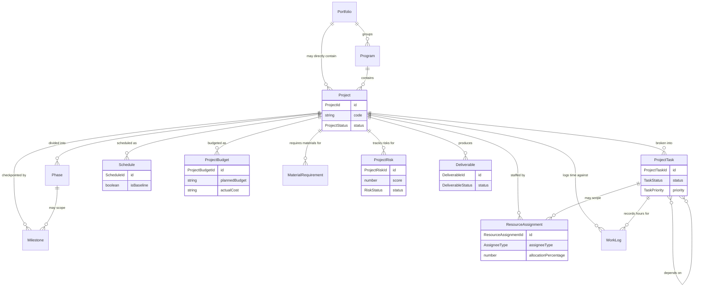

# Project Management Engine — Package Architecture

> **Lateen OS Architecture v1.0 (Locked)**

## Purpose

`@lateen-os/project-management-engine` is the canonical project-delivery layer for Lateen OS — Project Structure, Task Management, Resource Planning, the Scheduling Engine (deterministic CPM), Time Tracking, Budget Tracking, Material Planning, Project Risks, and Deliverables. Every capability is a **real, deterministic, in-memory implementation** — there is no contracts-only scaffold in this package; it was built directly as a real runtime (see `runtime.ts`'s `createProjectRuntime()`).

---

## Design principles

1. **DI only, no hidden state** — every `create*` factory takes its dependencies (repositories, event bus, `now()`) explicitly. No module-level singletons.
2. **Repositories stay internal** — `createProjectRuntime()` constructs every repository and injects it into the relevant service; only services and the query layer are returned.
3. **Own aggregate namespace, never a sibling's** — Business DNA's `Project`/`ProjectId` module is contracts-only (types + repository port, never wired into `BusinessDnaRuntime`) — exactly the same situation as its Employee/Department modules discovered while building HR Engine. This package therefore defines its own fresh `Project` aggregate and identifier namespace rather than attempting to reuse or sync against Business DNA's, and integrates with Business DNA only through the generic `businessProfile` service that genuinely is wired into its runtime.
4. **Archive/restore is a deliberate asymmetry** — a `Project`'s `archived` status has no outgoing edges in its ordinary transition table (`PROJECT_TRANSITIONS`); `restore()` is a distinct operation that returns it to the status held immediately before archiving (`statusBeforeArchive`) — the same pattern proven across Finance Engine (Chart of Accounts), HR Engine (Employee/Department), and Inventory Engine (Inventory Catalog).
5. **Dependencies are guarded against cycles at creation and mutation time** — `wouldCreateCycle()` is checked both when a task is first created with `dependsOnTaskIds` and on every subsequent `addDependency()` call, so the task graph handed to the Scheduling Engine is always a genuine DAG.
6. **Scheduling composes over the task graph, it never re-implements Task Management** — `computeCriticalPathSchedule()` is a pure function taking caller-supplied `{ taskId, durationDays, dependsOnTaskIds }` tuples; the Scheduling Engine module has no dependency on the Task Management module's repository, keeping the CPM calculation testable in complete isolation from how tasks are stored.
7. **"Compose, never duplicate" for Resource Planning** — `resource`'s allocation/capacity bookkeeping tracks only this package's own assignment records (`assigneeId` is an opaque foreign key). Real employee identity is resolved, never duplicated, via the Relationship Layer's `getEmployeeContext()`; real AI Workforce utilization is resolved via HR Engine's own already-integrated `relationships.getAiWorkforceUtilizationContext()` — never a direct dependency on `@lateen-os/ai-workforce` in production code.
8. **Budget Tracking never implements accounting** — `budget` computes and stores its own planned/actual/remaining/variance numbers. The *only* place this package touches a general ledger is `relationship-management`'s `recordProjectCostEntry()`, which calls Finance Engine's own public General Ledger API; no ledger logic is implemented here.
9. **Material Planning never manages inventory** — `material` tracks only required/reserved quantities and shortages as its own bookkeeping. The real stock reservation is `relationship-management`'s `reserveProjectMaterial()`, calling Inventory Engine's own public movement-reservation API.
10. **Risk scoring is fixed arithmetic** — `computeRiskScore()` is `probability × impact` (each a 1–5 ordinal rating, max score 25); `computeRiskLevel()` is a fixed banding function. **No model-based prediction anywhere.**
11. **A narrow, purposeful integration surface** — of the 9 required sibling packages, each is wired to exactly one meaningful Relationship Layer capability (see below) — always through the sibling's public runtime API, never a repository, never a modification to that package.
12. **Deterministic everywhere** — guarded lifecycle state machines, fixed decimal-string arithmetic (`shared/decimal.ts`), fixed CPM graph arithmetic, fixed overtime/utilization thresholds, fixed risk scoring. **No LLM anywhere in this package.**

---

## Module map

| Module | Responsibility | Key exports |
| ------ | -------------- | ------------ |
| `shared/` | IDs, decimal/date arithmetic, primitives, entity/domain-event/repository bases, `id.ts` helpers | — |
| `project/` | Project Structure — portfolios, programs, projects, phases, milestones, full project lifecycle | `ProjectStructureEngine`, `ProjectRepository` |
| `task/` | Task Management — tasks/subtasks, dependencies (cycle-guarded), priorities, labels | `TaskManagementEngine`, `ProjectTaskRepository` |
| `resource/` | Resource Planning — employee/AI-worker assignment, workload/capacity | `ResourcePlanningEngine`, `ResourceAssignmentRepository` |
| `scheduling/` | Scheduling Engine — deterministic CPM over the task dependency graph | `SchedulingEngine`, `ScheduleRepository` |
| `timetracking/` | Time Tracking — immutable work logs, actual-hours aggregation | `TimeTrackingEngine`, `WorkLogRepository` |
| `budget/` | Budget Tracking — planned/actual/remaining/variance | `BudgetTrackingEngine`, `ProjectBudgetRepository` |
| `material/` | Material Planning — required/reserved quantities, shortages | `MaterialPlanningEngine`, `MaterialRequirementRepository` |
| `risk/` | Project Risks — probability × impact scoring, mitigation | `ProjectRiskEngine`, `ProjectRiskRepository` |
| `deliverable/` | Deliverables — acceptance, approvals, completion | `DeliverableEngine`, `DeliverableRepository` |
| `relationship-management/` | CRM Engine / HR Engine / Finance Engine / Inventory Engine / Workflow Engine / Communication Hub / Analytics Engine / Business DNA / Institutional Memory integration | `RelationshipManagement` |
| `queries/` | Read-side query port | `ProjectQueries` |
| `events/` | Typed event bus | `ProjectEventBus`, `ProjectEventMap` |

Each aggregate module follows: `types.ts`, `repository.ts` (port), `repository.impl.ts` (real in-memory implementation), a `*.impl.ts` service/engine file, and `index.ts`.

---

## Dependency rules

```
┌──────────────────────────────────────────────┐
│      Applications, future consumers          │
└────────────────────┬─────────────────────────┘
                     │
                     ▼
┌─────────────────────────────────────────────────────────────┐
│           @lateen-os/project-management-engine               │
└──┬──────┬──────────┬───────────┬──────────┬──────────┬──────┘
   │      │          │           │          │          │
   ▼      ▼          ▼           ▼          ▼          ▼
┌─────┐┌─────┐┌────────────┐┌─────────┐┌──────────┐┌─────────┐
│crm- ││hr-  ││finance-    ││inventory││workflow- ││communi- │
│engin││engin││engine      ││-engine  ││engine    ││cation-  │
│e    ││e    ││(relations- ││(relatio-││(relation-││hub      │
│(rel-││(rel-││hip-mgmt)   ││nship-   ││ship-mgmt)││(relatio-│
│mgmt)││mgmt)││            ││mgmt)    ││          ││nship-   │
└─────┘└──┬──┘└────────────┘└─────────┘└──────────┘│mgmt)    │
          │                                         └─────────┘
          │ (HR Engine's own public              analytics-engine (relationship-mgmt)
          │  AI Workforce integration,                       │
          │  never a direct dependency)          institutional-memory (relationship-mgmt)
          ▼                                                  │
   ai-workforce (test-only,                                  ▼
   devDependency)                    @lateen-os/business-dna (OrganizationId + relationship-mgmt)
                                                    │
                                                    ▼
                                         @lateen-os/shared-kernel
```

### Allowed dependencies

- `shared-kernel` — `Entity`, `Identifier`, `Timestamp`, `EventBus`, `InMemoryRepository`, `AuditInfo`, `Money`, `CurrencyCode`
- `business-dna` — `OrganizationId` (type-only reuse); `createBusinessDnaRuntime`'s public `businessProfile.get()` (optional, injected via Relationship Layer)
- `crm-engine` — `createCrmRuntime`'s public `customers.get()` (optional, injected via Relationship Layer)
- `hr-engine` — `createHrRuntime`'s public `employees.get()` and `relationships.getAiWorkforceUtilizationContext()` (optional, injected via Relationship Layer) — the sole, indirect path to AI Workforce data
- `finance-engine` — `createFinanceRuntime`'s public `generalLedger.createJournalEntry()` / `postJournalEntry()` (optional, injected via Relationship Layer, project cost entries only)
- `inventory-engine` — `createInventoryRuntime`'s public `movements.reserve()` (optional, injected via Relationship Layer, material reservation only)
- `workflow-engine` — `createWorkflowRuntime`'s public `defineWorkflow()` / `startWorkflow()` (optional, injected via Relationship Layer)
- `communication-hub` — `createCommunicationRuntime`'s public `notifications` service (optional, injected via Relationship Layer)
- `analytics-engine` — `createAnalyticsRuntime`'s public `metrics.recordGauge()` (optional, injected via Relationship Layer)
- `institutional-memory` — `createInstitutionalMemoryRuntime`'s public `lifecycle.create()` (optional, injected via Relationship Layer)
- `ai-workforce` — **devDependency only**, imported exclusively by `tests/integration.test.ts` to construct a real `WorkforceRuntime` and inject its `queries` into a real `HrRuntime`, proving the passthrough is genuine — never imported from `src/`

### Forbidden

- Persistence, ORM, or any real database/storage backend
- AI/ML frameworks or LLM SDKs of any kind
- A direct production dependency on `@lateen-os/ai-workforce` — all AI Workforce context flows through HR Engine's own public integration
- Importing a repository from any integration package (their public runtime APIs only)
- Modifying any integration package to accommodate the Project Management Engine
- Upstream packages importing `project-management-engine` (no inversion)
- Posting to a General Ledger, or implementing any other accounting operation, from within this package — Budget Tracking only ever produces planned/actual/remaining/variance figures; any real posting happens in Finance Engine, invoked (not reimplemented) via the Relationship Layer
- Mutating inventory stock levels directly — Material Planning only ever tracks required/reserved bookkeeping; any real stock reservation happens in Inventory Engine, invoked (not reimplemented) via the Relationship Layer
- Any model-based or heuristic schedule/risk optimization — the Scheduling Engine's critical path and Project Risks' scoring are both fixed, deterministic arithmetic

---

## Dependency diagram

```mermaid
flowchart BT
  subgraph consumers [Future Consumers]
    APP[Applications]
  end

  subgraph pm ["@lateen-os/project-management-engine"]
    IDX[index.ts]
    RT[runtime.ts]
    PROJ[project]
    TASK[task]
    RES[resource]
    SCHED[scheduling]
    TT[timetracking]
    BUD[budget]
    MAT[material]
    RISK[risk]
    DELIV[deliverable]
    REL[relationship-management]
    Q[queries]
    EV[events]
  end

  subgraph deps [Integration Packages]
    CRM[crm-engine]
    HR[hr-engine]
    FIN[finance-engine]
    INV[inventory-engine]
    WF[workflow-engine]
    CH[communication-hub]
    ANA[analytics-engine]
    BD[business-dna]
    IM[institutional-memory]
    SK[shared-kernel]
  end

  subgraph testonly [Test-only]
    AIW[ai-workforce]
  end

  APP --> IDX
  IDX --> RT
  RT --> PROJ & TASK & RES & SCHED & TT & BUD & MAT & RISK & DELIV & REL & Q & EV

  Q --> PROJ & TASK & RES & SCHED & BUD & RISK & DELIV

  REL -.->|customers.get, public API| CRM
  REL -.->|employees.get + relationships.getAiWorkforceUtilizationContext, public API| HR
  REL -.->|generalLedger.createJournalEntry/postJournalEntry, public API| FIN
  REL -.->|movements.reserve, public API| INV
  REL -.->|defineWorkflow/startWorkflow, public API| WF
  REL -.->|notifications, public API| CH
  REL -.->|metrics.recordGauge, public API| ANA
  REL -.->|businessProfile.get, public API| BD
  REL -.->|lifecycle.create, public API| IM

  HR -.->|queries, test-only integration proof| AIW

  PROJ & TASK & RES & SCHED & TT & BUD & MAT & RISK & DELIV --> SK

  CRM --> SK
  HR --> SK
  FIN --> SK
  INV --> SK
  WF --> SK
  CH --> SK
  ANA --> SK
  BD --> SK
  IM --> SK
```



---

## Aggregate relationship diagram



---

## Public API

```typescript
import {
  createProjectRuntime,
  project,
  task,
  resource,
  scheduling,
  timeTracking,
  budget,
  material,
  risk,
  deliverable,
  relationshipManagement,
  queries,
  events,
  type ProjectRuntime,
  type Project,
  type ProjectTask,
  type ResourceAssignment,
  type Schedule,
  type WorkLog,
  type ProjectBudget,
  type MaterialRequirement,
  type ProjectRisk,
  type Deliverable,
} from '@lateen-os/project-management-engine';
```

Namespace exports for each module; root re-exports for aggregate interfaces, service ports, pure calculation functions, and the composition root. Repositories are exported as **types only** (for advanced/testing use) — never as constructed instances outside `createProjectRuntime()`.

---

## Version alignment

| Artifact | Count |
| -------- | ----- |
| Lateen OS Architecture | v1.0 Locked |
| Project lifecycle states | 6 (draft, active, on_hold, completed, cancelled, archived) + restore |
| Task lifecycle states | 6 (planned, ready, in_progress, blocked, completed, cancelled) |
| Phase lifecycle states | 3 (planned, active, completed) |
| Milestone lifecycle states | 3 (pending, reached, missed) |
| Risk lifecycle states | 5 (identified, mitigating, resolved, accepted, occurred) |
| Deliverable lifecycle states | 5 (draft, in_review, accepted, rejected, completed) |
| Material requirement statuses | 4 (planned, reserved, fulfilled, cancelled) |
| Query methods | 9 (`ProjectQueries`) |
| Runtime events | 10 (`ProjectEventMap`) |
| External integrations | 9 (CRM Engine, HR Engine, Finance Engine, Inventory Engine, Workflow Engine, Communication Hub, Analytics Engine, Business DNA, Institutional Memory) — all via public API |
