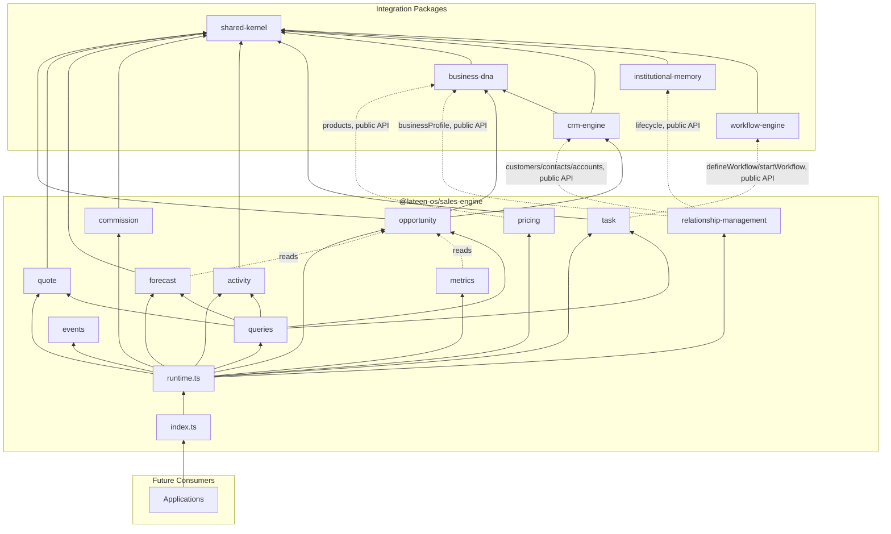
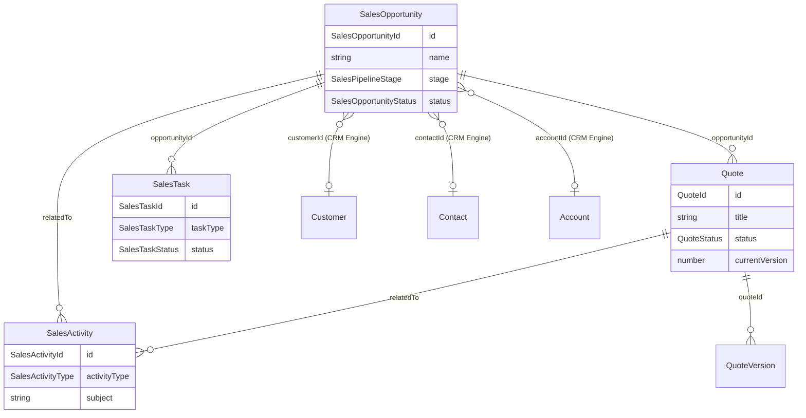

# Sales Engine — Package Architecture

> **Lateen OS Architecture v1.0 (Locked)**

## Purpose

`@lateen-os/sales-engine` is the canonical revenue-conversion layer for Lateen OS — the Sales Opportunity Lifecycle and deterministic Sales Pipeline, the Quote Engine, Product Pricing, Sales Forecasting, the Commission Engine, the Sales Activities timeline, and Sales Tasks. Every capability is a **real, deterministic, in-memory implementation** — there is no contracts-only scaffold in this package; it was created directly as a real runtime (see `runtime.ts`'s `createSalesRuntime()`).

---

## Design principles

1. **DI only, no hidden state** — every `create*` factory takes its dependencies (repositories, event bus, `now()`, and — for `pricing`, `relationship-management`, and `task` — the optional external collaborators) explicitly. No module-level singletons.
2. **Repositories stay internal** — `createSalesRuntime()` constructs every repository and injects it into the relevant service; only services and the query layer are returned.
3. **A narrow, named integration surface** — CRM Engine, Business DNA, Institutional Memory, and Workflow Engine are consumed only where a capability explicitly names them, and only through each package's public runtime API (never their repositories, never a modification to those packages).
4. **Deterministic everywhere** — guarded lifecycle state machines, deterministic quote/pricing/commission/forecast arithmetic, deterministic search ranking. No AI/LLM, no embeddings, no wall-clock coupling in business logic.
5. **Composition over duplication** — `forecast` and `metrics` compute over the same `SalesOpportunityRepository` the `opportunity` module owns, rather than each keeping its own copy of pipeline data.

---

## Module map

| Module | Responsibility | Key exports |
| ------ | -------------- | ------------ |
| `shared/` | IDs (reusing Business DNA's and CRM Engine's canonical ids), primitives, entity/domain-event/repository bases, `id.ts`/`errors.ts` helpers | — |
| `opportunity/` | Sales Opportunity Lifecycle + deterministic Sales Pipeline | `SalesOpportunityLifecycle`, `SalesOpportunityRepository`, `SalesPipelineStage` |
| `quote/` | Quote Engine | `QuoteEngine`, `QuoteRepository`, `QuoteVersionRepository`, `computeQuoteTotals()` (pure) |
| `pricing/` | Product Pricing, composed with Business DNA | `ProductPricingService`, `computeNegotiatedPrice()` / `computeVolumePrice()` (pure) |
| `forecast/` | Sales Forecast | `ForecastEngine`, `ForecastSnapshotRepository`, `probabilityForStage()` (pure) |
| `commission/` | Commission Engine | `CommissionEngine`, `CommissionPlanRepository`, `calculateCommission()` (pure) |
| `activity/` | Sales Activities timeline | `SalesActivityTimeline`, `SalesActivityRepository` |
| `task/` | Sales Tasks, composed with Workflow Engine | `SalesTasksService`, `SalesTaskRepository` |
| `relationship-management/` | CRM Engine / Business DNA / Institutional Memory integration | `RelationshipManagement` |
| `metrics/` | Performance Metrics | `PerformanceMetricsEngine`, pure `computeWinRate()` / `computeLossRate()` / `computeAverageDealSize()` / `computeAverageSalesCycleDays()` / `computePipelineValue()` |
| `queries/` | Read-side query port | `SalesQueries` |
| `events/` | Typed event bus | `SalesEventBus`, `SalesEventMap` |

Each aggregate module follows: `types.ts`, `repository.ts` (port), `repository.impl.ts` (real in-memory implementation), a `*.impl.ts` lifecycle/service/engine file, and `index.ts`.

---

## Dependency rules

```
┌──────────────────────────────────────────────┐
│      Applications, future consumers          │
└────────────────────┬─────────────────────────┘
                     │
                     ▼
┌──────────────────────────────────────────────┐
│            @lateen-os/sales-engine            │
└──────┬──────────────┬──────────────┬─────────┘
       │              │              │
       ▼              ▼              ▼
┌────────────┐ ┌─────────────┐ ┌──────────────┐  ┌────────────────┐
│ business-  │ │ crm-engine  │ │ institution- │  │ workflow-engine │
│ dna        │ │             │ │ al-memory    │  │                 │
└────────────┘ └─────────────┘ └──────────────┘  └────────────────┘
       │              │              │                   │
       └──────────────┴──────────────┴───────────────────┘
                     ▼
            @lateen-os/shared-kernel
```

### Allowed dependencies

- `shared-kernel` — `Entity`, `Identifier`, `Timestamp`, `EventBus`, `InMemoryRepository`, `AuditInfo`, `CurrencyCode`
- `business-dna` — `OrganizationId`, `CustomerId`, `EmployeeId`, `ProductId`, `ProductBundleId` (type-only reuse); `createBusinessDnaRuntime`'s public `products` (Product Catalog) and `businessProfile` services (optional, injected)
- `crm-engine` — `AccountId`, `ContactId` (type-only reuse); `createCrmRuntime`'s public `customers` / `contacts` / `accounts` services (optional, injected)
- `institutional-memory` — `createInstitutionalMemoryRuntime`'s public `lifecycle` service (optional, injected)
- `workflow-engine` — `createWorkflowRuntime`'s public `defineWorkflow` / `startWorkflow` composition-root operations (optional, injected)

Decision Engine and Intelligence Engine are permitted per the architecture but intentionally unused — no capability in this commit calls for an automated decision or an AI-driven insight.

### Forbidden

- Persistence, ORM, vector DB, embedding libraries
- AI/ML frameworks or LLM SDKs
- Importing a repository from Business DNA, CRM Engine, Institutional Memory, or Workflow Engine (their public runtime APIs only)
- Modifying Business DNA, CRM Engine, Institutional Memory, or Workflow Engine to accommodate the Sales Engine
- Upstream packages importing `sales-engine` (no inversion)

---

## Dependency diagram



---

## Aggregate relationship diagram



---

## Public API

```typescript
import {
  createSalesRuntime,
  opportunity,
  quote,
  pricing,
  forecast,
  commission,
  activity,
  task,
  relationshipManagement,
  metrics,
  queries,
  events,
  type SalesRuntime,
  type SalesOpportunity,
  type Quote,
  type SalesPipelineStage,
} from '@lateen-os/sales-engine';
```

Namespace exports for each module; root re-exports for aggregate interfaces, lifecycle/service ports, and the composition root. Repositories are exported as **types only** (for advanced testing) — never as constructed instances outside `createSalesRuntime()`.

---

## Version alignment

| Artifact | Count |
| -------- | ----- |
| Lateen OS Architecture | v1.0 Locked |
| Sales Pipeline stages | 8 (new, discovery, qualified, proposal, negotiation, verbal_commit, won, lost) |
| Sales Opportunity Lifecycle actions | 8 (create, qualify, propose, negotiate, closeWon, closeLost, reopen, archive) |
| Sales Activity types | 5 (meeting, call, email, demo, follow_up) |
| Sales Task types | 3 (proposal_approval, contract_review, follow_up_reminder) |
| Commission plan types | 3 (fixed, percentage, tiered) |
| Query methods | 7 (`SalesQueries`) |
| Runtime events | 9 (`SalesEventMap`) |
| External integrations | 4 (CRM Engine, Business DNA, Institutional Memory, Workflow Engine) — all via public API |
