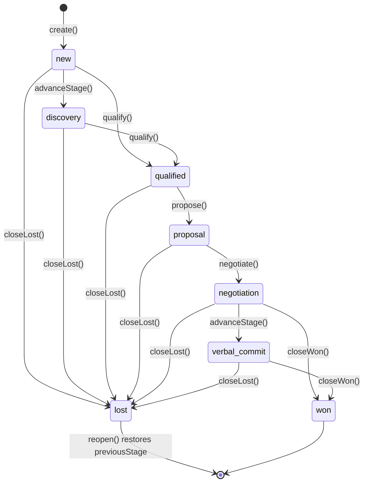

# Sales Model

> Real, implemented model for the Sales Engine — see [README.md](./README.md) for the runtime and [ARCHITECTURE.md](./ARCHITECTURE.md) for the module map.

---

## Sales Opportunity Lifecycle + Sales Pipeline

`opportunity/lifecycle.impl.ts`'s `createSalesOpportunityLifecycle()` implements the required 8 lifecycle actions atop one guarded, deterministic pipeline stage machine (`canTransitionSalesStage()`):

- **`create()`** — stage `'new'`, status `'active'`. Publishes `opportunity.created`.
- **`qualify()`** — advances to `'qualified'` (legal from `'new'` or `'discovery'`). Publishes `opportunity.qualified`.
- **`propose()`** — advances to `'proposal'`. Publishes `proposal.created`.
- **`negotiate()`** — advances to `'negotiation'`. Publishes `negotiation.started`.
- **`closeWon(amount?)`** — advances to `'won'`, optionally overriding the final amount, stamps `closedAt` and `previousStage`. Publishes `deal.won`. Terminal.
- **`closeLost(reason?)`** — advances to `'lost'`, records `lostReason`, stamps `closedAt` and `previousStage`. Publishes `deal.lost`.
- **`reopen()`** — only legal from `'lost'`; restores the stage the opportunity was in immediately before it closed (`previousStage`, defaulting to `'negotiation'` if none was recorded), and clears `lostReason`/`closedAt`. A **won** deal is never reopened — it is genuinely closed.
- **`archive()`** — sets `status: 'archived'`, independent of pipeline stage; an archived opportunity can no longer be updated or transitioned.

`advanceStage()` is exposed directly too — it is the raw, guarded mechanism every named action above is built on, and the only way to move an opportunity into `'discovery'` or `'verbal_commit'`, which have no dedicated named action.

---

## Quote Engine

`quote/engine.impl.ts`'s `createQuoteEngine()` implements real `createQuote` / `updateQuote` / `archiveQuote`, each backed by immutable version history:

- **Deterministic totals** — `computeQuoteTotals(lineItems, discountPct?, taxRatePct?)` is a pure function: each line item's `quantity × unitPrice` is reduced by its own `discountPct` first; the line totals are summed into a `subtotal`; the quote-level `discountPct` is then applied to that subtotal to produce `discountTotal`; `taxRatePct` is applied to the *discounted* subtotal to produce `taxTotal`; `total = discountedSubtotal + taxTotal`. Every figure is a fixed 2-decimal string — no floating-point drift across runs.
- **Version history** — every `createQuote` / `updateQuote` / `archiveQuote` call increments `currentVersion` and persists a full `QuoteVersion` snapshot via `getVersionHistory()`, so a quote's entire negotiation history (every price/discount/line-item change) is recoverable.
- Only `'draft'` quotes may be updated; `archiveQuote()` is terminal.

---

## Product Pricing

`pricing/engine.impl.ts`'s `createProductPricingService()` is the **only** module composed with the Business DNA Product Catalog (through `createBusinessDnaRuntime()`'s public `products` service):

- **List price** — `getListPrice()` fetches a real Business DNA `Product.basePrice`.
- **Bundle pricing** — `getBundlePrice()` fetches a real Business DNA `ProductBundle.bundlePrice`.
- **Negotiated price** — `computeNegotiatedPrice(listPrice, discountPct)` is a pure function reducing the list price by a discount percentage.
- **Volume pricing** — `computeVolumePrice(listPrice, quantity, tiers)` is a pure function: the highest `VolumePricingTier` whose `minQuantity` is at or below the given quantity applies, either overriding the unit price outright or discounting the list price.

Business DNA is optional — with it absent, `getListPrice()`/`getBundlePrice()` return `null`, while the negotiated/volume calculators remain fully usable offline (they take a list price as a plain argument, not a catalog lookup).

---

## Sales Forecast

`forecast/engine.impl.ts`'s `createForecastEngine()` implements deterministic forecasting — **no AI model**:

- **Probability by stage** — a fixed lookup table, `STAGE_PROBABILITY` / `probabilityForStage()`: `new` 10%, `discovery` 20%, `qualified` 35%, `proposal` 50%, `negotiation` 65%, `verbal_commit` 85%, `won` 100%, `lost` 0%.
- **Weighted pipeline** — `computeWeightedAmount(amount, stage) = amount × probabilityForStage(stage)`, applied to every open (active, not won/lost) opportunity.
- **Expected revenue** — `generateForecast()` sums every open opportunity's weighted amount into `weightedPipelineValue`, alongside the unweighted `totalOpenAmount`.
- **Monthly forecast** — every open opportunity is bucketed by the `YYYY-MM` of its `expectedCloseDate` (opportunities with none fall into an `'unscheduled'` bucket, sorted last); each bucket reports its own total, weighted amount, and opportunity count.

Every `generateForecast()` call persists a new immutable `ForecastSnapshot` and publishes `forecast.updated` — `getLatestForecast()` and `listForecasts()` (most recent first) read that history back.

---

## Commission Engine

`commission/engine.impl.ts` supports the three required commission plan types via one pure function, `calculateCommission(plan, dealAmount)`:

- **`fixed`** — a flat `fixedAmount`, independent of the deal amount.
- **`percentage`** — `dealAmount × percentageRate / 100`.
- **`tiered`** — the highest `CommissionTier` whose `minAmount` is at or below the deal amount has its `rate` applied to the **whole** deal amount (not marginal banding) — simple and fully deterministic.

`createCommissionEngine()` additionally manages named, persisted `CommissionPlan`s (`createPlan` / `archivePlan` / `getPlan`) and `calculateCommissionForPlan()`, which loads a plan by id and delegates to the pure calculator.

---

## Sales Activities

`activity/timeline.impl.ts`'s `createSalesActivityTimeline()` logs five activity types — `meeting`, `call`, `email`, `demo`, and `follow_up` — against any sales record via a generic `relatedTo: { entityType, entityId }` reference (`'opportunity'` or `'quote'`). `follow_up` activities start `completed: false`; `complete()` marks them done. `listByEntity()` returns every activity for a record, most recent first.

---

## Sales Tasks — composed with the Workflow Engine

`task/service.impl.ts`'s `createSalesTasksService()` generates deterministic workflow requests for the three required task types — `proposal_approval`, `contract_review`, `follow_up_reminder` — by composing the real, injected Workflow Engine's public `defineWorkflow()` + `startWorkflow()` operations, never a Workflow Engine repository:

1. **`generateTask()`** lazily defines (once per organization + task type, cached in-process) a canonical single-step `'human'`-task workflow for the task type, then starts a real instance carrying `{ opportunityId, notes, dueAt }` as workflow variables. The resulting `SalesTask` records both the `workflowDefinitionId` and `workflowInstanceId`.
2. **`completeTask()`** marks the task `'completed'`. For a `proposal_approval` task completed with `{ approved: true }`, it publishes `proposal.approved`.
3. **`cancelTask()`** marks the task `'cancelled'`.

The Workflow Engine collaborator is optional — with it absent, tasks are still recorded (status, notes, due date), just with no workflow linkage, keeping the Sales Engine fully usable offline.

---

## Relationship Layer — the only integration surface with CRM Engine, Business DNA, and Institutional Memory

Per the architecture rules, `relationship-management/service.impl.ts` is the module that talks to CRM Engine, Business DNA, and Institutional Memory for anything beyond `pricing`'s Product Catalog composition — and only through each package's public runtime API:

| Integration | How | Required? |
| ------------ | --- | ---------- |
| CRM Engine | `getCustomerContext()` / `getContactContext()` / `getAccountContext()` fetch real CRM Engine records via `customers.get()` / `contacts.get()` / `accounts.get()`. Structural reuse too: `shared/identifiers.ts` reuses `ContactId`/`AccountId` directly | Optional — inject `{ crm }` |
| Business DNA | `getBusinessProfileContext()` fetches the real `BusinessProfile` via `businessProfile.get()`. Structural reuse too: `shared/identifiers.ts` reuses `OrganizationId`/`CustomerId`/`EmployeeId`/`ProductId`/`ProductBundleId` directly | Optional — inject `{ businessDna }` |
| Institutional Memory | `logActivityToMemory()` creates a real Institutional Memory `KnowledgeEntry` (`knowledgeType: 'observation'`, `category: 'commercial'`, `source: 'sales-engine'`, tagged with the activity type and related-entity type) | Optional — inject `{ institutionalMemory }` |

Every method returns `null` when its collaborator wasn't injected at `createSalesRuntime()` time — never throws, never mocks. The Sales Engine's own test suite proves each integration is **real** by constructing actual `createCrmRuntime()` / `createBusinessDnaRuntime()` / `createInstitutionalMemoryRuntime()` instances and asserting genuine cross-package state — never a mock of any sibling package.

---

## Performance Metrics

`metrics/engine.impl.ts`'s `createPerformanceMetricsEngine()` computes, deterministically, over the same opportunity data the pipeline itself owns:

| Metric | Formula |
| ------ | ------- |
| Win rate | `won / (won + lost) × 100`, `0` if nothing has closed |
| Loss rate | `lost / (won + lost) × 100`, `0` if nothing has closed |
| Average deal size | mean `amount` across every **won** opportunity |
| Average sales cycle | mean days between `createdAt` and `closedAt` across every **closed** (won or lost) opportunity |
| Pipeline value | sum of `amount` across every **open** (active, not won/lost) opportunity |

---

## Query Layer

`queries/sales-queries.impl.ts`'s `createSalesQueries()` is the real, read-only query layer exposed by `createSalesRuntime()` — composed purely over the Sales Engine repositories, never returning one:

| Method | Returns |
| ------ | ------- |
| `findOpportunities()` | Opportunities filtered by stage / status / customerId |
| `findQuotes()` | Quotes filtered by status / opportunityId |
| `findForecasts()` | Every forecast snapshot, most recently generated first |
| `findPipeline()` | **Every** opportunity grouped by `SalesPipelineStage` — the pipeline/kanban view, every stage key present even if empty |
| `findActivities()` | Activities filtered by type / related entity, most recent first |
| `findTasks()` | Tasks filtered by status / type / opportunityId |
| `searchSales()` | Deterministic keyword search across opportunities (by name) and quotes (by title), exact match scored above substring match, ranked and tie-broken by id |

`findOpportunities()` and `findPipeline()` intentionally return different shapes over the same underlying data: `findOpportunities()` is a flat, filterable list; `findPipeline()` is the stage-grouped pipeline view.

---

## Constraints

- No UI, API, LLM, or persistence-adapter implementation in this package — every repository is in-memory and internal to `createSalesRuntime()`.
- Deterministic and offline: every `create*` factory accepts an injectable `now()`; quote/pricing/commission/forecast/metrics arithmetic and search ranking never depend on Map/Set iteration order.
- CRM Engine, Business DNA, Institutional Memory, and Workflow Engine are touched **only** through `pricing` and `relationship-management` (behavioral, CRM/Business DNA/Institutional Memory), `task` (behavioral, Workflow Engine), and `shared/identifiers.ts` (structural) — never their repositories, never a change to those packages.
