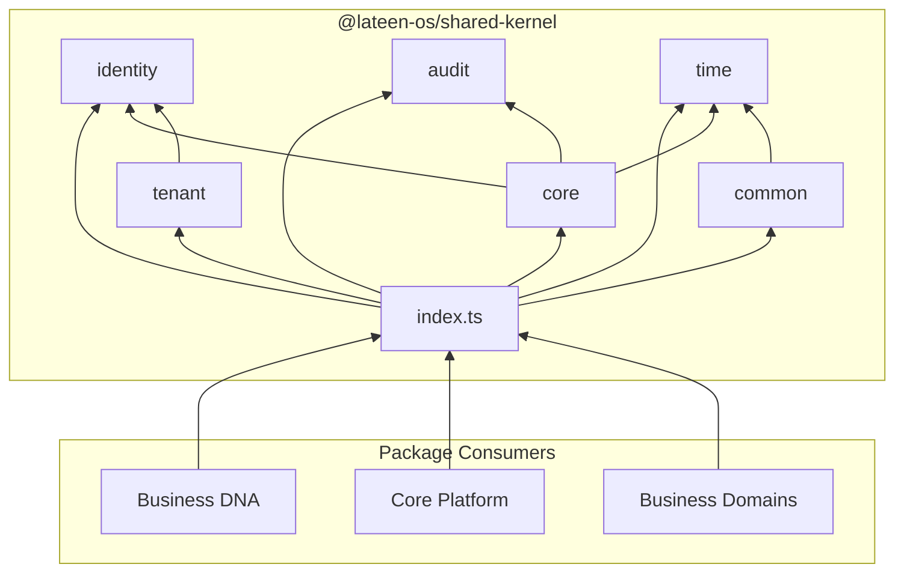

# Shared Kernel — Package Architecture

> **Lateen OS Architecture v1.0 (Locked)**  
> Layer: Cross-cutting foundation (below Business DNA)

## Purpose

`@lateen-os/shared-kernel` provides the **foundational building blocks** used by every other package in Lateen OS. It encodes domain-driven design (DDD) primitives as pure TypeScript types and minimal generic utilities — no frameworks, business logic, persistence, HTTP, or UI.

Business DNA (Layer 1) and all higher layers depend on this package. Shared Kernel has **zero upstream dependencies** within the monorepo.

---

## Module reference

### `core/` — DDD building blocks

| Export | Kind | Description |
| ------ | ---- | ----------- |
| `Entity` | Interface | Base entity with stable `id` |
| `AggregateRoot` | Interface | Entity + optional audit/version metadata |
| `ValueObject` | Interface | Marker for immutable, equality-by-structure objects |
| `DomainEvent` | Interface | Base event: `eventId`, `eventName`, `occurredAt`, `aggregateId`, `payload` |
| `DomainEventName` | Type | Template literal `` `${Entity}.${Action}` `` |
| `DomainError` | Interface | Structured error: `code`, `message`, optional `details` |
| `createDomainError` | Function | Pure factory for `DomainError` values |
| `Result`, `Ok`, `Err` | Types | Discriminated union for explicit success/failure |
| `ok`, `err`, `isOk`, `isErr` | Functions | Result constructors and type guards |
| `GuardClause`, `GuardResult` | Types | Guard contract and result alias |
| `guardFail`, `guardPass` | Functions | Guard outcome helpers |
| `isNullOrUndefined`, `isNonEmptyString`, `isDefined` | Functions | Generic type predicates (no domain rules) |
| `Specification` | Interface | `isSatisfiedBy(candidate)` rule contract |
| `AndSpecification`, `OrSpecification`, `NotSpecification` | Interfaces | Composable specification shapes |

### `identity/` — Identifier primitives

| Export | Kind | Description |
| ------ | ---- | ----------- |
| `UUID` | Type alias | RFC 4122 UUID string |
| `Identifier` | Type alias | Semantic alias of `UUID` for entity IDs |
| `BrandedIdentifier` | Type | Factory for domain-specific branded ID types |

### `common/` — Shared value objects

| Export | Kind | Description |
| ------ | ---- | ----------- |
| `Money` | Interface | Decimal string amount + ISO 4217 currency |
| `CurrencyCode` | Type alias | ISO 4217 code |
| `Address` | Interface | Postal address |
| `Email` | Type alias | Email address string |
| `Phone` | Type alias | Phone number string |
| `Percentage` | Type alias | Decimal string percentage |
| `TimeRange` | Interface | `start` / `end` timestamps |
| `GeoLocation` | Interface | WGS 84 coordinates |

### `audit/` — Audit and versioning

| Export | Kind | Description |
| ------ | ---- | ----------- |
| `AuditInfo` | Interface | `createdAt`, `updatedAt`, optional actor IDs |
| `VersionInfo` | Interface | Optimistic concurrency `version` counter |

### `tenant/` — Multi-tenant identifiers

| Export | Kind | Description |
| ------ | ---- | ----------- |
| `TenantId` | Type alias | Tenant isolation boundary |
| `OrganizationId` | Type alias | Organization (tenant root) |
| `BranchId` | Type alias | Branch within an organization |

### `time/` — Time primitives

| Export | Kind | Description |
| ------ | ---- | ----------- |
| `Timestamp` | Type alias | ISO 8601 UTC date-time string |
| `DateOnly` | Type alias | ISO 8601 calendar date (YYYY-MM-DD) |
| `Clock` | Interface | Port: `now(): Timestamp` |

---

## Dependency rules

```
┌──────────────────────────────────────────────┐
│  Business DNA, Core, Domains, Applications   │
└────────────────────┬─────────────────────────┘
                     │ imports
                     ▼
┌──────────────────────────────────────────────┐
│           @lateen-os/shared-kernel           │
│  core ← identity, audit, time                │
│  common ← time                               │
│  tenant ← identity                           │
└──────────────────────────────────────────────┘
                     │
                     ▼ (no monorepo deps)
                  (none)
```

### Allowed

- Any package may import `@lateen-os/shared-kernel` or subpaths (`/core`, `/common`, …).
- Submodules may import sibling submodules within shared-kernel (acyclic graph).

### Forbidden

- Shared Kernel importing from Business DNA or any higher layer.
- Shared Kernel importing frameworks, ORMs, HTTP clients, or UI libraries.
- Domain-specific entity types in Shared Kernel.

---

## Public API conventions

### Root entry (`@lateen-os/shared-kernel`)

- **Namespace exports:** `core`, `identity`, `common`, `audit`, `tenant`, `time`
- **Root re-exports:** commonly used types and functions for ergonomic imports

### Subpath exports

| Subpath | Module |
| ------- | ------ |
| `@lateen-os/shared-kernel/core` | DDD primitives |
| `@lateen-os/shared-kernel/identity` | UUID, Identifier |
| `@lateen-os/shared-kernel/common` | Value objects |
| `@lateen-os/shared-kernel/audit` | Audit metadata |
| `@lateen-os/shared-kernel/tenant` | Tenant IDs |
| `@lateen-os/shared-kernel/time` | Timestamps, Clock |

---

## Integration with Business DNA

Business DNA re-exports shared-kernel types where they overlap, preserving backward compatibility:

| Business DNA export | Shared Kernel source |
| ------------------- | -------------------- |
| `Entity` | `core/Entity` |
| `Money`, `Address`, `CurrencyCode` | `common/` |
| `ISODateTime` | `time/Timestamp` (alias) |
| `Auditable` | `Pick<AuditInfo, 'createdAt' \| 'updatedAt'>` |
| `OrganizationId`, `BranchId` | `tenant/` |
| `EntityId`, `EventId` | `identity/Identifier` |
| `DomainEvent` | Extends `core/DomainEvent` + `organizationId` |
| `DomainEventName` | Re-exported from `core/` |

Business-specific types (`BusinessCode`, aggregate IDs, commercial VOs) remain in Business DNA.

---

## Dependency diagram



---

## Design decisions

1. **Types-first** — Interfaces and type aliases over classes; no ORM or serialization coupling.
2. **String-based IDs** — `UUID`/`Identifier` are `string` aliases for backward compatibility; `BrandedIdentifier` available for stricter contexts.
3. **Minimal runtime** — Only pure factories (`ok`, `err`, `createDomainError`) and generic type guards; no domain validation.
4. **Clock as port** — Time access abstracted for testability; implementations in infrastructure.
5. **Specification as contract** — Interface only; rule implementations live in bounded contexts.

---

## Version alignment

| Artifact | Status |
| -------- | ------ |
| Lateen OS Architecture | v1.0 Locked |
| Shared Kernel modules | 6 / 6 |
| Business DNA integration | Re-exports (backward compatible) |
