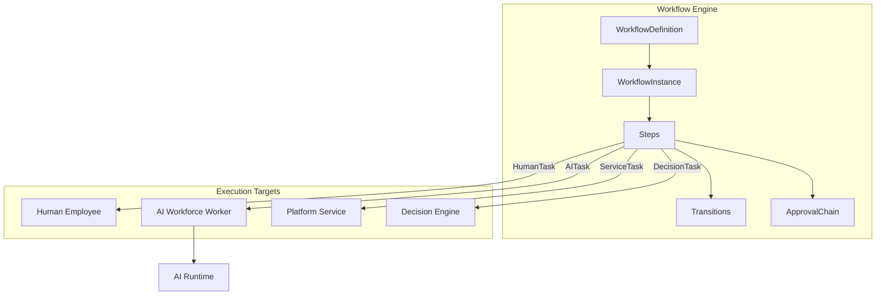
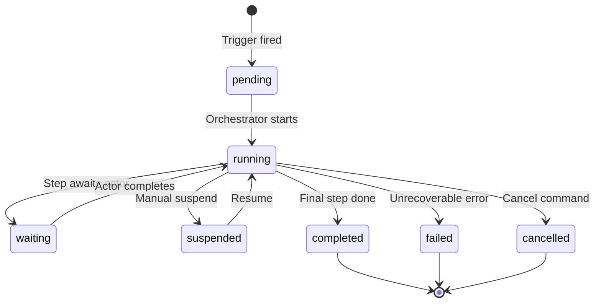
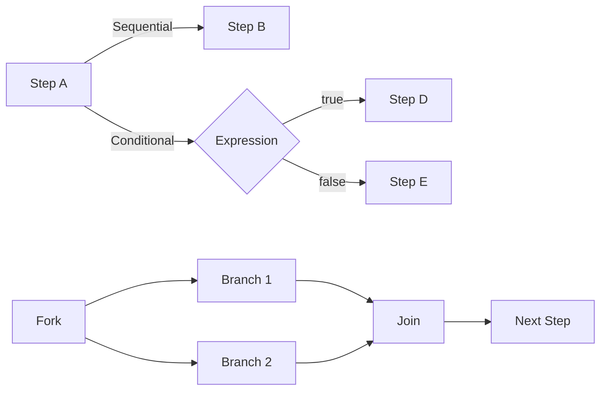
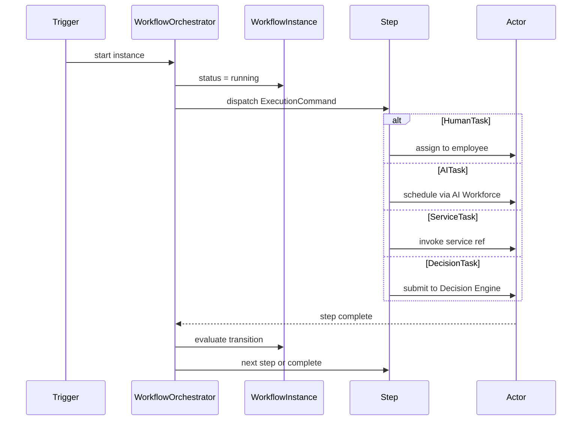
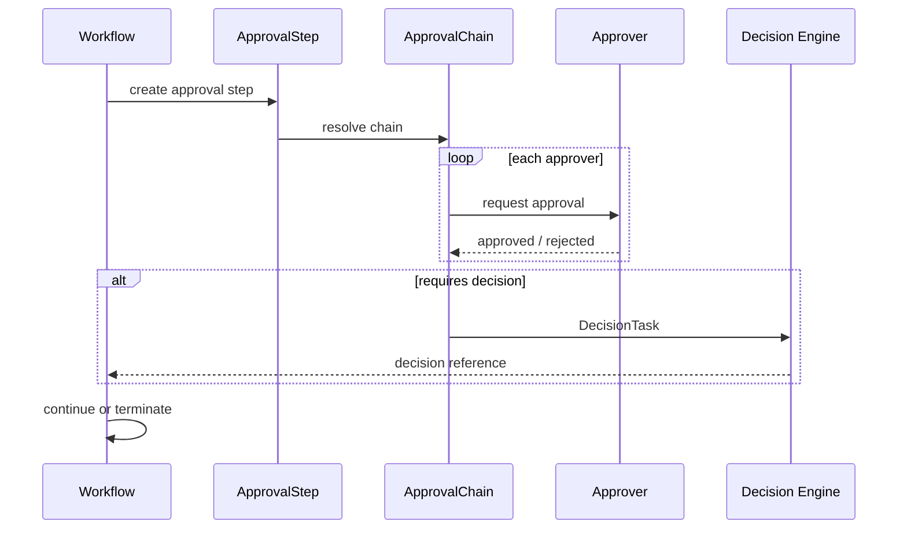

# Workflow Engine Model

> Contracts for the canonical orchestration layer of Lateen OS.

---

## Orchestration Stack

---

## Workflow Lifecycle

### WorkflowStatus values

| Status | Meaning |
| ------ | ------- |
| `pending` | Instance created, not yet started |
| `running` | Actively executing steps |
| `waiting` | Blocked on human, AI, service, or approval |
| `suspended` | Paused by operator |
| `completed` | All steps finished successfully |
| `failed` | Terminal error |
| `cancelled` | Terminated by user or system |
| `terminated` | Forced shutdown |

---

## Step Types

| Type | Interface | Handoff |
| ---- | --------- | ------- |
| Human | `HumanTask` | Employee or role inbox |
| AI | `AITask` | WorkerId → AI Runtime TaskId |
| Service | `ServiceTask` | ServiceReference + operation |
| Decision | `DecisionTask` | Decision Engine submission |
| Gateway | `WorkflowStep` | Conditional / parallel routing |

---

## Transition Flow

| Transition | Interface | Use |
| ---------- | --------- | --- |
| Sequential | `Transition` | Default next step |
| Conditional | `ConditionalTransition` | Rule / expression evaluation |
| Parallel | `ParallelTransition` | Fork/join branches |

---

## Trigger Types

| Trigger | Interface | Starts when |
| ------- | --------- | ----------- |
| Manual | `ManualTrigger` | User or system invokes |
| Scheduled | `ScheduledTrigger` | Cron / interval fires |
| Event | `EventTrigger` | NATS subject pattern matches |

---

## Execution Flow

The orchestrator **coordinates** — actors **execute**.

---

## Approval Flow

---

## Query Port

| Method | Returns |
| ------ | ------- |
| `findWorkflow()` | Definition, version, steps |
| `findRunningWorkflows()` | Active instances |
| `findWaitingTasks()` | Step instances awaiting actors |
| `findHistory()` | Workflow, execution, and audit history |

---

## Domain Events

| Event | When |
| ----- | ---- |
| `workflow.defined` | New definition created |
| `workflow.published` | Version published |
| `workflow_instance.started` | Instance begins |
| `workflow_instance.completed` | Instance finishes |
| `step.started` | Step execution begins |
| `step.waiting` | Step blocked on actor |
| `approval.requested` | Approval chain activated |
| `approval.approved` | Approver accepts |

---

## Constraints

- Contracts only — no UI, REST, database, LLM, or persistence
- Engine coordinates; platform packages execute
- All decision finalization via `@lateen-os/decision-engine`
