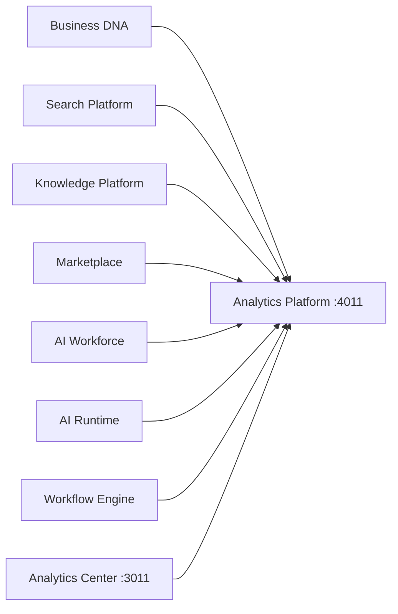

# Analytics Platform Architecture

**Architecture v1.0 (locked)** · Epic 33

## Purpose

The Enterprise Analytics Platform is the unified BI layer. It aggregates metrics from existing Lateen OS services without owning business data or implementing business logic.

## System Context

## Pipeline

| Step | Description |
| ---- | ----------- |
| Collect | Stub collectors per domain |
| Normalize | Standardize data points |
| Aggregate | Average by metric |
| Calculate Metrics | Build snapshots |
| Generate KPIs | Dashboard KPI cards |
| Prepare Dashboard | Charts and layout |
| Return | Response with latency |

## Non-Goals

- No data warehouse
- No business logic
- No modifications to Business DNA, Workflow Engine, AI Runtime, AI Workforce, Decision Engine, Knowledge Platform, Enterprise Search

## Related Docs

- [ANALYTICS_MODEL.md](./ANALYTICS_MODEL.md)
- [REPORTS.md](./REPORTS.md)
- [DASHBOARDS.md](./DASHBOARDS.md)
