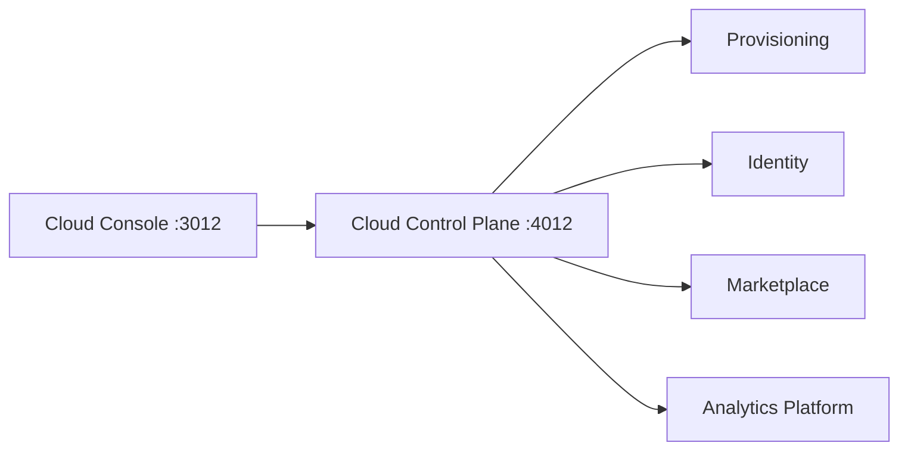

# Cloud Platform Architecture

**Architecture v1.0 (locked)** · Epic 34

## Purpose

Lateen Cloud is the SaaS control plane. It orchestrates organizations, tenants, subscriptions, deployments, billing, and monitoring without implementing business logic.

## System Context

## Non-Goals

- No business logic or payment gateway
- No modifications to Kernel, Business DNA, Identity, Marketplace, Provisioning, Analytics, AI Runtime, AI Brain

## Related Docs

- [TENANT_MODEL.md](./TENANT_MODEL.md)
- [BILLING_MODEL.md](./BILLING_MODEL.md)
- [OPERATIONS.md](./OPERATIONS.md)
