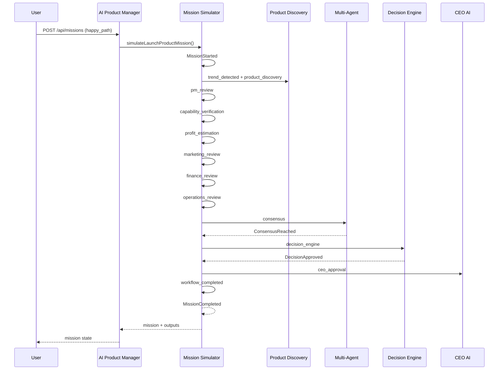
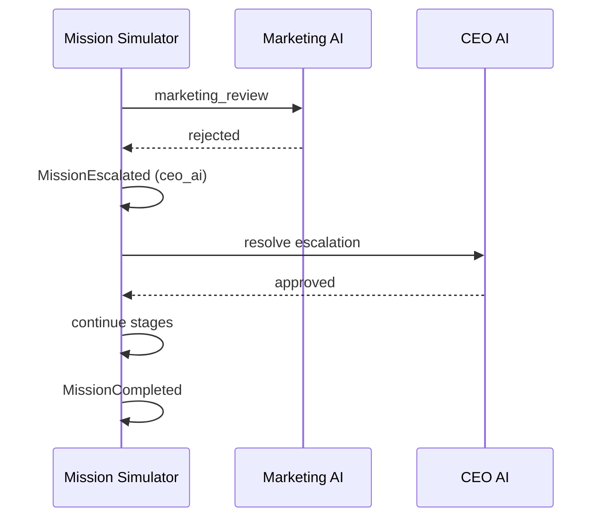
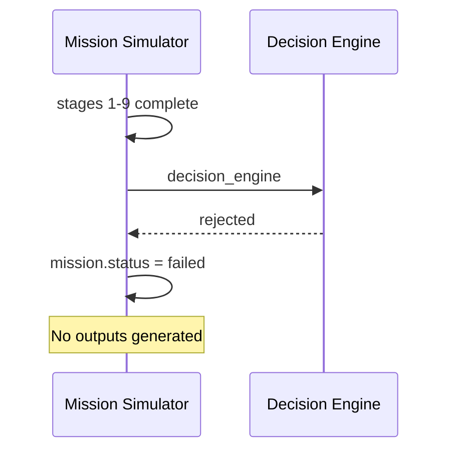
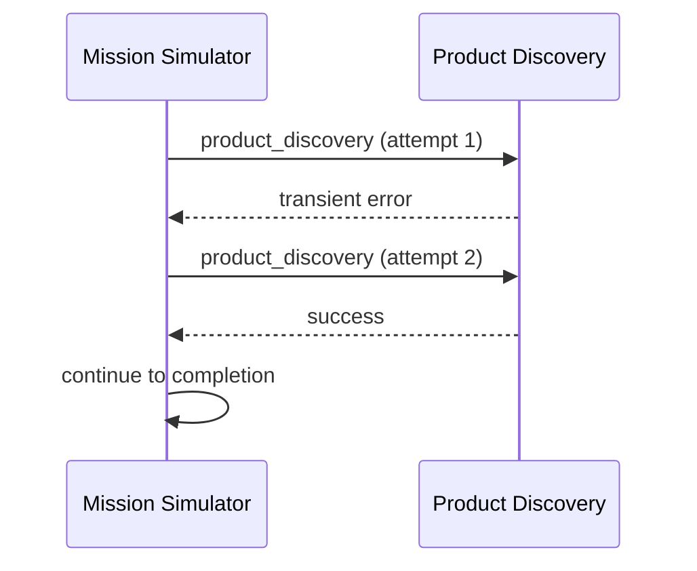
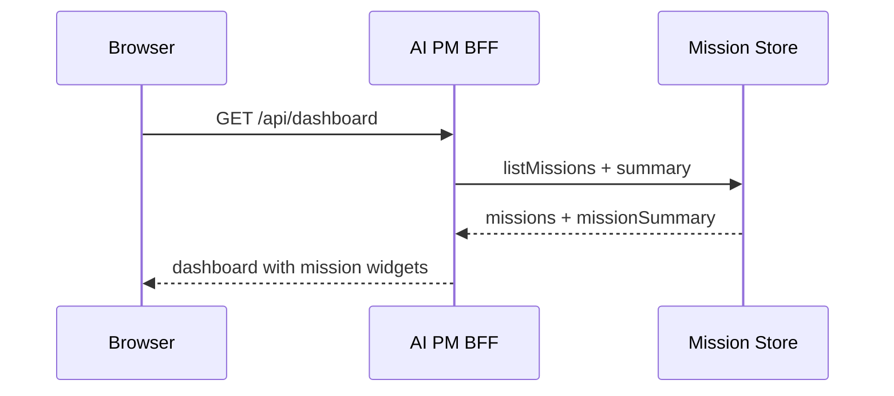

# Launch Product — Sequence

## Happy path sequence

```mermaid
sequenceDiagram
  participant User
  participant AIPM as AI Product Manager
  participant Sim as Mission Simulator
  participant PD as Product Discovery
  participant MA as Multi-Agent
  participant DE as Decision Engine
  participant CEO as CEO AI

  User->>AIPM: POST /api/missions (happy_path)
  AIPM->>Sim: simulateLaunchProductMission()
  Sim->>Sim: MissionStarted
  Sim->>PD: trend_detected + product_discovery
  Sim->>Sim: pm_review
  Sim->>Sim: capability_verification
  Sim->>Sim: profit_estimation
  Sim->>Sim: marketing_review
  Sim->>Sim: finance_review
  Sim->>Sim: operations_review
  Sim->>MA: consensus
  MA-->>Sim: ConsensusReached
  Sim->>DE: decision_engine
  DE-->>Sim: DecisionApproved
  Sim->>CEO: ceo_approval
  Sim->>Sim: workflow_completed
  Sim-->>Sim: MissionCompleted
  Sim-->>AIPM: mission + outputs
  AIPM-->>User: mission state
```

## Escalation path sequence

```mermaid
sequenceDiagram
  participant Sim as Mission Simulator
  participant MKT as Marketing AI
  participant CEO as CEO AI

  Sim->>MKT: marketing_review
  MKT-->>Sim: rejected
  Sim->>Sim: MissionEscalated (ceo_ai)
  Sim->>CEO: resolve escalation
  CEO-->>Sim: approved
  Sim->>Sim: continue stages
  Sim->>Sim: MissionCompleted
```

## Rejected path sequence

```mermaid
sequenceDiagram
  participant Sim as Mission Simulator
  participant DE as Decision Engine

  Sim->>Sim: stages 1-9 complete
  Sim->>DE: decision_engine
  DE-->>Sim: rejected
  Sim->>Sim: mission.status = failed
  Note over Sim: No outputs generated
```

## Retry path sequence

```mermaid
sequenceDiagram
  participant Sim as Mission Simulator
  participant PD as Product Discovery

  Sim->>PD: product_discovery (attempt 1)
  PD-->>Sim: transient error
  Sim->>PD: product_discovery (attempt 2)
  PD-->>Sim: success
  Sim->>Sim: continue to completion
```

## Dashboard sequence

```mermaid
sequenceDiagram
  participant Browser
  participant BFF as AI PM BFF
  participant Store as Mission Store

  Browser->>BFF: GET /api/dashboard
  BFF->>Store: listMissions + summary
  Store-->>BFF: missions + missionSummary
  BFF-->>Browser: dashboard with mission widgets
```
